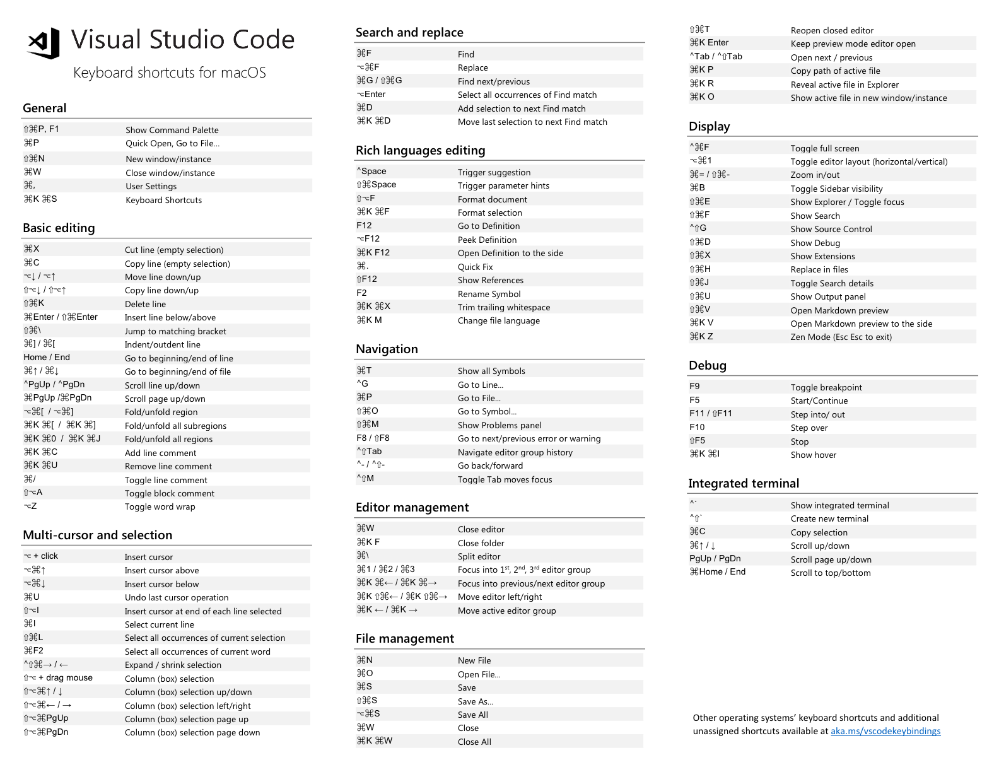

# VSCode / VS Code

Created: 2017-12-21 12:47:15 +0500

Modified: 2022-12-07 08:48:20 +0500

---

# Remove empty lines

Regex - ^(s)*$n

#

# Debugging Python

<https://github.com/microsoft/ptvsd>

<https://www.youtube.com/watch?v=b78Tg-YmJZI>

#

# CodeServer / Online Machine Environments

VS Code in the browser

<https://github.com/cdr/code-server>

<https://coder.com>

<https://vscode.dev>

<https://github.com/conwnet/github1s>

Gitpod - <https://www.freecodecamp.org/news/exampro-cloud-developer-environment-certification-gitpod-course>

codeanywhere

# Extensions

- Docker
- Kubernetes
- Git graph
- Python
- Terraform
- Local History
- Clipboard History
- Remote - Containers
- SonarLint
- Data Preview (>Data: Preview Data)
- Git Lens
- Version Lens
- Prettier
- Format Toggle
- Settings Sync
- Cobalt2
- Multiple clipboards for VSCode
- **Live Share**
- **Settingssync**
- CSV
  - Excel Viewer
  - RainbowCSV
- Reverse Search
- Thunder client - postman for vscode
- draw.io extension (test.dio file)
- <https://marketplace.visualstudio.com/items?itemName=softwaredotcom.swdc-vscode>
- <https://marketplace.visualstudio.com/items?itemName=alefragnani.project-manager>

## Shortcuts

Shift+Option+F - format document

CMD + option + z - zen mode

CMD + Shift + D - Duplicate line

CMD + B = show hide project view

Opt + Shift + O = remove unused migrations

Opt + shift + down/up arrow = copy line down

CMD + T = Show all Symbols

CMD + Shit + O = Go to symbol (functions)

CTRL + R = open recent dialogue

CTRL + G = Go to line

CMD + SHIFT + F = search whole project

CMD + SHIFT + H = Find and replace whole project

## Navigation -

Forward / Back

Ctrl + - / Ctrl + Shift + -

Command Running

Command + p ( + >)

- git log

Command + Shit + p (directly run commands)

- Shell Command : Install code in PATH
- $ code .

- **Fold** folds the innermost uncollapsed region at the cursor:
  - ⌥+⌘+[on macOS
- **Unfold** unfolds the collapsed region at the cursor:
  - ⌥+⌘+]on macOS
- **Fold All** folds all regions in the editor:
  - ⌘+ (K=>0) (zero) on macOS
- **Unfold All** unfolds all regions in the editor:
  - ⌘+ (K=>J) on macOS

- Ctrl - (go back)
- Ctrl Shift - (go forward)
- Shift Option F (Format document)
- Option + Command + Up/Down - Multiline cursor
- **Select All > Option + shift + i - Every line multiline cursor**
- **Search > Command + Shift + L - Cursor in every searched line**

<https://dev.to/selrond/tips-to-use-vscode-more-efficiently-3h6p>

<https://www.youtube.com/watch?v=WPqXP_kLzpo>

<https://www.youtube.com/watch?v=ifTF3ags0XI>

## Settings.json (command + <)

- User Settings- Settings that apply globally to any instance of VS Code you open.
- Workspace Settings- Settings stored inside your workspace and only apply when the workspace is opened.

{

"python.jediEnabled": false,

"editor.suggestSelection": "first",

"vsintellicode.modify.editor.suggestSelection": "automaticallyOverrodeDefaultValue",

"window.openFoldersInNewWindow": "on",

"window.openFilesInNewWindow": "on",

"terminal.integrated.shell.osx": "/bin/zsh",

"PATH": "/bin/zsh",

"files.autoSave": "onFocusChange",

"workbench.editor.enablePreview": false,

"editor.wordWrap": "on",

"explorer.confirmDelete": false,

"sqltools.connections": [

{

"database": "test",

"dialect": "MySQL",

"name": "localhost",

"password": "test",

"port": 3306,

"server": "localhost",

"username": "test"

}

],

"git.enableSmartCommit": true,

"window.zoomLevel": 0,

"[java]": {

"editor.defaultFormatter": "redhat.java"

},

"java.configuration.checkProjectSettingsExclusions": false,

"git.autofetch": true,

"diffEditor.ignoreTrimWhitespace": false,

"explorer.confirmDragAndDrop": false,

"remote.extensionKind": {

"ms-azuretools.vscode-docker": "workspace"

},

"git.ignoreMissingGitWarning": true,

"python.dataScience.sendSelectionToInteractiveWindow": true,

"python.dataScience.askForKernelRestart": false,

"workbench.startupEditor": "welcomePage",

"workbench.iconTheme": "vscode-icons",

"editor.renderWhitespace": "all",

"files.exclude": {

"**/**pycache**": true

}

"terminal.integrated.scrollback": 10000,

}
