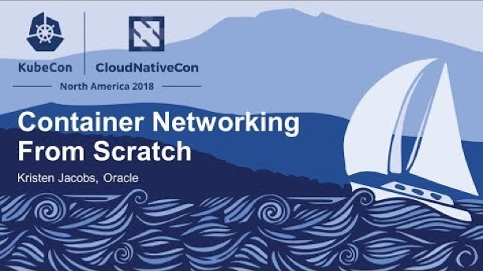

# Others

Created: 2019-03-22 18:06:02 +0500

Modified: 2020-06-02 23:02:31 +0500

---

**Kubernetes Network Model**

EveryPodgets its own IP address. This means you do not need to explicitly create links betweenPodsand you almost never need to deal with mapping container ports to host ports. This creates a clean, backwards-compatible model wherePodscan be treated much like VMs or physical hosts from the perspectives of port allocation, naming, service discovery, load balancing, application configuration, and migration.

Kubernetes imposes the following fundamental requirements on any networking implementation (barring any intentional network segmentation policies):
-   Pods on a node can communicate with all pods on all nodes without NAT
-   All nodes can communicate with all containers (and vice-versa) without NAT
-   The IP that a container sees itself as is the same IP that others see it as
-   Agents on a node (e.g. system daemons, kubelet) can communicate with all pods on that node

Note: For those platforms that supportPodsrunning in the host network (e.g. Linux)
-   Pods in the host network of a node can communicate with all pods on all nodes without NAT

[Container Networking From Scratch - Kristen Jacobs, Oracle](https://www.youtube.com/watch?v=6v_BDHIgOY8)

**Extending Kubernetes > Service Catalog**

Service Catalog is an extension API that enables applications running in Kubernetes clusters to easily use external managed software offerings, such as a datastore service offered by a cloud provider.

It provides a way to list, provision, and bind with external[Managed Services](https://kubernetes.io/docs/reference/glossary/?all=true#term-managed-service)from[Service Brokers](https://kubernetes.io/docs/reference/glossary/?all=true#term-service-broker)without needing detailed knowledge about how those services are created or managed.

A service broker, as defined by the[Open service broker API spec](https://github.com/openservicebrokerapi/servicebroker/blob/v2.13/spec.md), is an endpoint for a set of managed services offered and maintained by a third-party, which could be a cloud provider such as AWS, GCP, or Azure. Some examples of managed services are Microsoft Azure Cloud Queue, Amazon Simple Queue Service, and Google Cloud Pub/Sub, but they can be any software offering that can be used by an application.

Using Service Catalog, a[cluster operator](https://kubernetes.io/docs/reference/glossary/?all=true#term-cluster-operator)can browse the list of managed services offered by a service broker, provision an instance of a managed service, and bind with it to make it available to an application in the Kubernetes cluster.

<https://kubernetes.io/docs/concepts/extend-kubernetes/service-catalog

