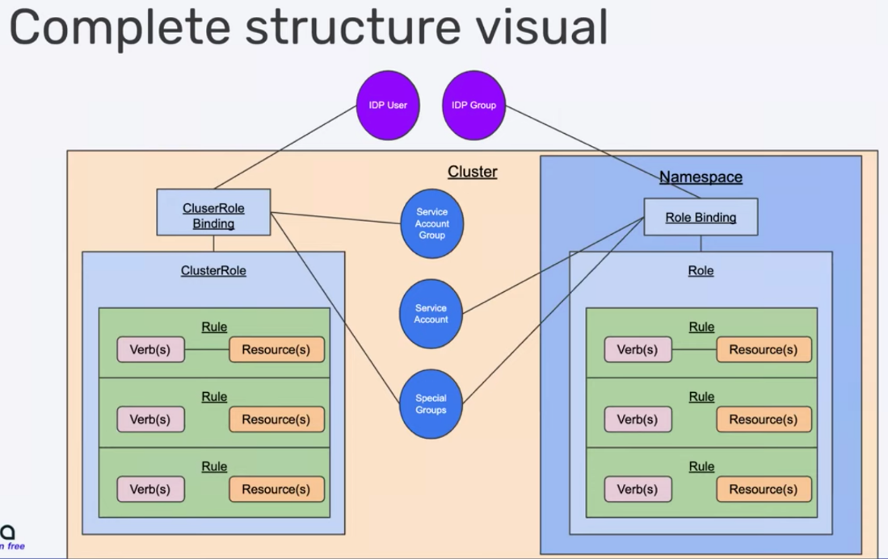

# RBAC

Created: 2019-09-22 14:38:23 +0500

Modified: 2020-09-14 10:29:16 +0500

---

## Authorization

<https://kubernetes.io/docs/reference/access-authn-authz/authorization

<https://kubernetes.io/docs/reference/access-authn-authz/rbac

<https://www.cncf.io/blog/2018/08/01/demystifying-rbac-in-kubernetes

## Commands

## Create access role for kubernetes dashboard

kubectl create clusterrolebinding kubernetes-dashboard -n kube-system --clusterrole=cluster-admin --serviceaccount=kube-system:kubernetes-dashboard

<https://www.youtube.com/watch?v=mvvCf3eQ1cc>
