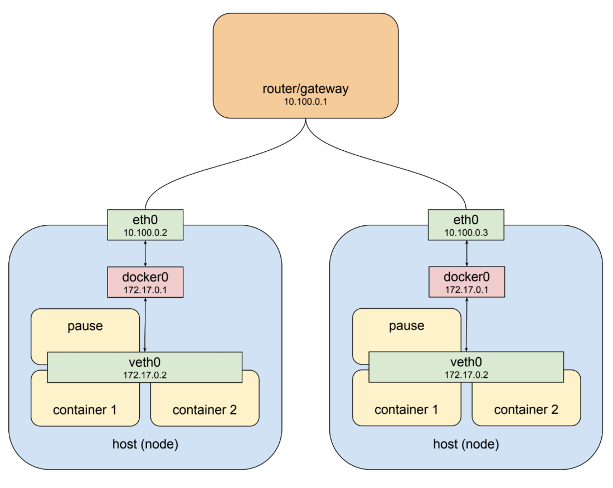
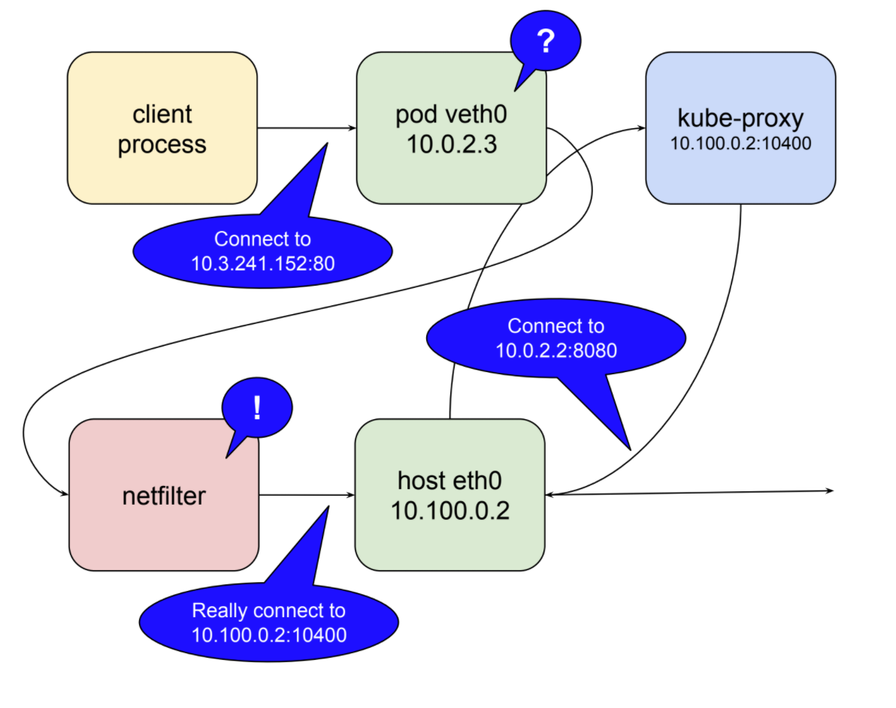
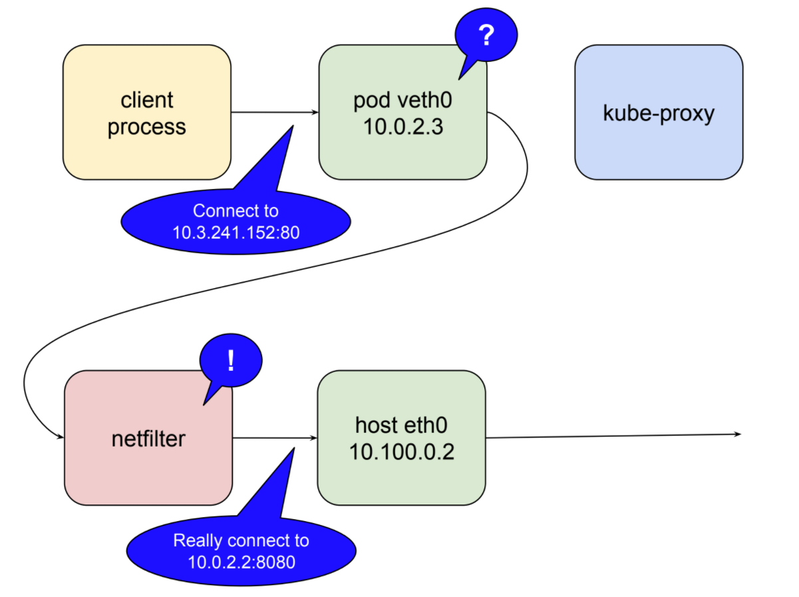
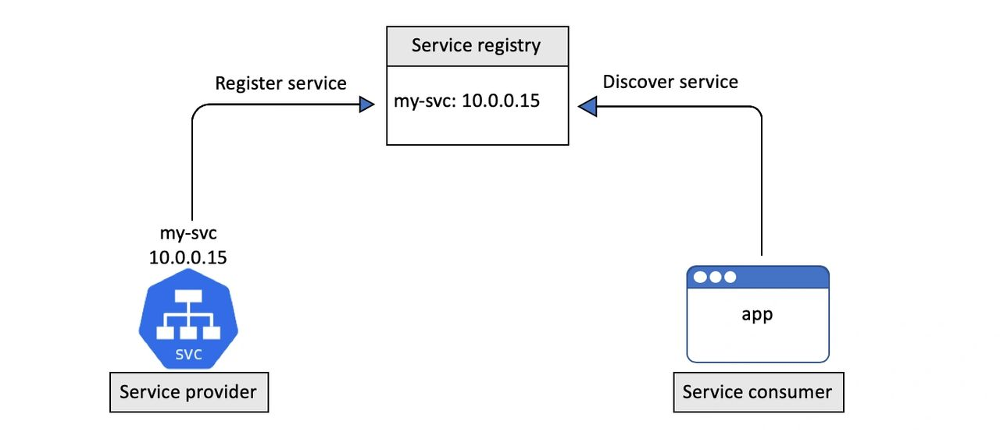
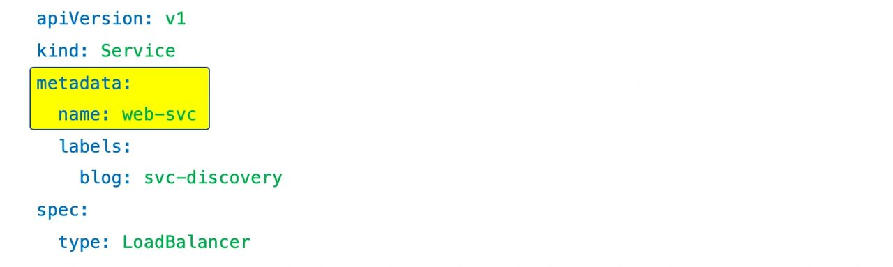
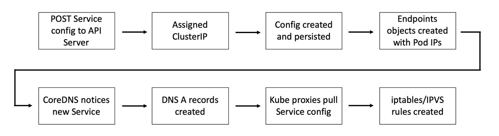
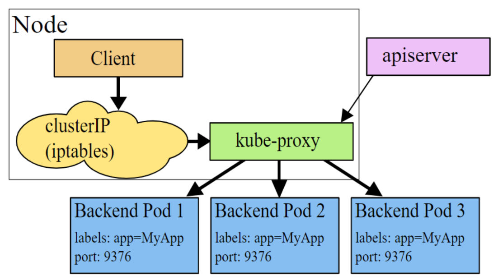
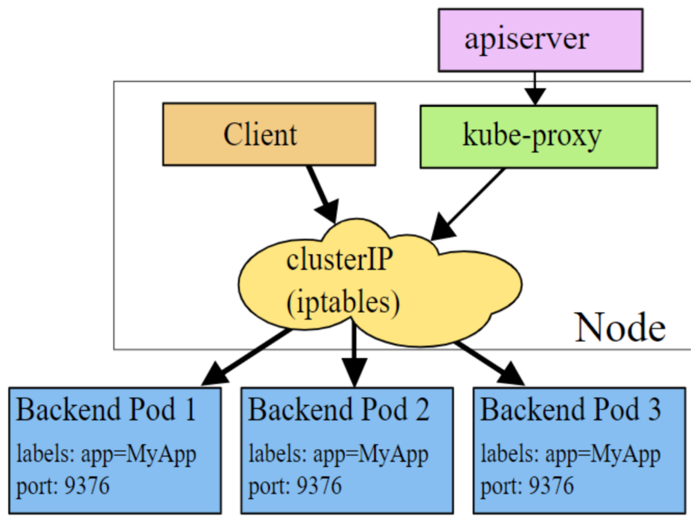
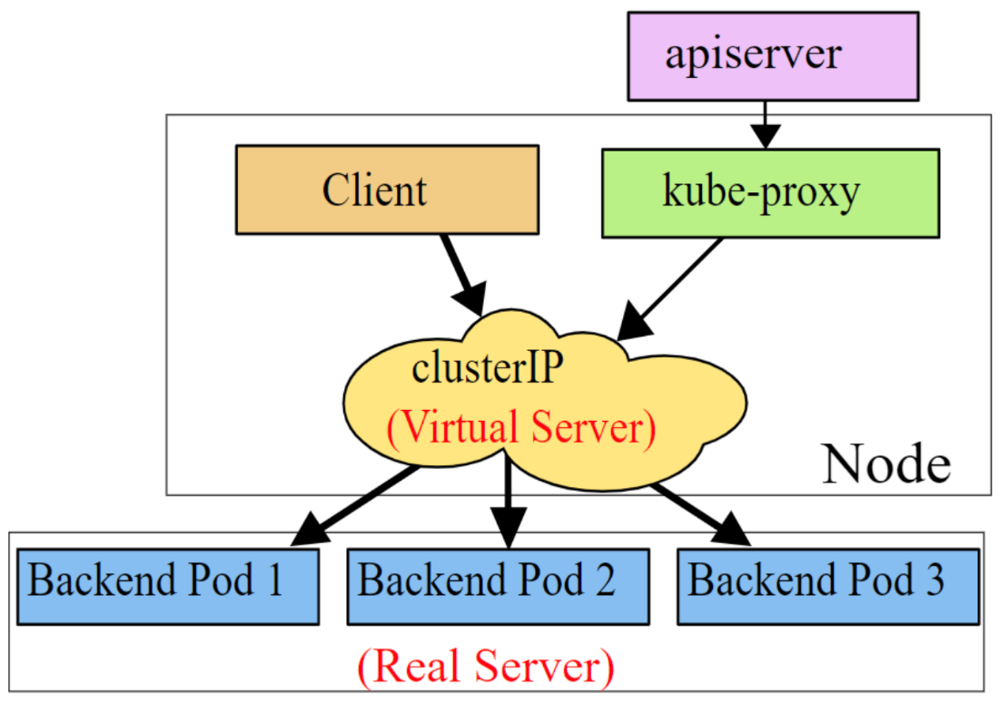

# Services, LoadBalancing and Networking

Created: 2019-01-30 15:44:07 +0500

Modified: 2020-08-26 11:59:46 +0500

---

1.  Services

2.  DNS for Services and Pods

3.  Connecting Applications with Services

4.  Ingress

5.  Network Policies

6.  Adding entries to Pod /etc/hosts with HostAliases

## Kubernetes Networking

Pods - share a network stack

it means that all the containers in a pod can reach each other on localhost.

## Pod Network Architecture

## Kubernetes Network Architecture

cbr - custom bridge

## Netfilter

Netfilter is a rules-based packet processing engine. It runs in kernel space and gets a look at every packet at various points in its life cycle. It matches packets against rules and when it finds a rule that matches it takes the specified action. Among the many actions it can take is redirecting the packet to another destination. That's right, netfilter is a kernel space proxy.

## Kubernetes Service Discovery

There's two major operations that relate to service discovery:

a.  service registration

b.  service discovery

## Service registration

Service registrationis the process of registering a service in aservice registryso that other services can discover it.

Kubernetes uses DNS for theservice registry.

To enable this, every Kubernetes cluster operates a well-knowninternal DNS servicethat runs as a set of Pods in thekube-systemNamespace. We usually call this the "cluster DNS".

Every Kubernetes Service isautomatically registeredwith the cluster DNS.

The registration process looks like this:

a.  You POST a new Service definition to the API Server

b.  The request is authenticated, authorized, and subjected to admission policies

c.  The Service is allocated aClusterIP(virtual IP address) and persisted to the cluster store

d.  The Service configuration is disseminated across the cluster (more on this later)

e.  The cluster's DNS service notices the new Service and creates the necessaryDNS A records

Step 5 is the secret sauce in this process. Thecluster DNSservice is based on[CoreDNS](https://coredns.io/)and runs as aKubernetes-native application. This means that it knows it's running on Kubernetes and implements acontrollerthat watches the API Server for new Service objects. Any time it sees a new Service object, it creates the DNS records that allow the Service name to be resolved to its ClusterIP. This means that Services don't have to care about the process of registering with DNS, the CoreDNS controller watches for new Service objects and makes the DNS magic happen.

It's important to understand that the name registered with DNS is the value ofmetadata.nameand that the ClusterIP is dynamically assigned by Kubernetes.

Once a Service is registered with the cluster's DNS it can bediscoveredby other Pods running on the cluster...

## Service Discovery

Forservice discoveryto work, every Pod needs to know know the location of the cluster DNS and use it. To make this work, every container in every Pod has its/etc/resolv.conffile configured to use the cluster DNS.

Every Kubernetes node runs a system service calledkube-proxy. This is a Pod-based Kubernetes native app that implements acontrollerthatwatches the API Serverfor new Service objects and creates localiptables, orIPVS, rules that tell the Node to trap on packets destined for theservice networkand forward them to individual Pod IPs.

> Interestingly, kube-proxy is not a proxy in the normal sense of the term. All it does is create and manage iptables/IPVS rules. The name comes from the fact it used to run with a userspace proxy.

## Summary

When a newServiceis created it is allocated a virtual IP address called aClusterIP. This is automatically registered against the name of the Service in the cluster's internal DNS and relevant Endpoints objects (or Endpoints slices) are created to hold the list of healthy Pods with that the Service will load-balance to.

At the same time, all Nodes in the cluster are configured with the iptables/IPVS rules that listen for traffic to this ClusterIP and redirect it to real Pod IPs. The is summarised in the image below, though the ordering of some events might be slightly different..

When a Pod needs to connect to another Pod, it does this via a Service. It sends a query to the cluster DNS to resolve the name of the Service to its ClusterIP and then send traffic to the ClusterIP. This ClusterIP is on a special network called theService network.However, there are no routes to theService network, so the Pod sends traffic to its default gateway. This gets forwarded to an interface on the Node the Pod is running, and eventually the default gateway of the Node. As part of this operation, the Node's kernel traps on the address and rewrites the destination IP field in the packet header so that it now goes to the IP of a healthy Pod.

This is summarised in the image below.

Last but not least... all Pods are on the same flat overlay network and routes exist to this network and the rest is simple.

<https://nigelpoulton.com/blog/f/demystifying-kubernetes-service-discovery>

## Others
-   Kubernetes performsIP address management(**IPAM**) to keep track of used and free IP addresses on the Pod network.

## Source ip preservation in loadbalancer

kubectl patch svc flask-republisher -n testing -p '{"spec":{"externalTrafficPolicy":"Local"}}'

<https://kubernetes.io/docs/tutorials/services/source-ip

## Kube-proxy

Kube-proxy is a go application which can work in three modes:
-   **userspace**

In this mode, Kube-proxy installs iptables rules which capture traffic to a Service's ClusterIP and redirects that traffic to Kube-proxy's listening port. Kube-proxy then chooses a backend Pod and forwards the request to it.

kube-proxy serves as an OSI layer 4 load balancer in this model. Since Kube-proxy runs in the userspace, packages need to be copied back and forth between kernelspace and userspace, adding extra latency in the proxy process. The advantage is that Kube-proxy can retry other Pod if the first Pod is not available.

-   **iptables**

To avoid the additional copies between kernelspace and userspace, Kube-proxy can work on iptables mode. Kube-proxy creates an iptables rule for each of the backend Pods in the Service. After catching the traffic sent to the ClusterIP, iptables forwards that traffic directly to one of the backend Pod using DNAT. In this mode, Kube-proxy no longer serves as the OSI layer 4 proxy. It only creates corresponding iptables rules. Without switching between kernelspace and userspace, the proxy process is more efficient.

-   **ipvs**

This model is similar to iptables because both ipvs and iptables are base on netfilter hook in kernelspace. Ipvs uses hash tables to store rules, meaning it's faster than iptables, especially in a large cluster where there're thousands of services. In addition, ipvs supports more load balancing algorithms.

## ip tables

<https://docs.google.com/drawings/d/1MtWL8qRTs6PlnJrW4dh8135_S9e2SaawT410bJuoBPk/edit>

## References

<https://medium.com/google-cloud/understanding-kubernetes-networking-pods-7117dd28727>

<https://medium.com/google-cloud/understanding-kubernetes-networking-services-f0cb48e4cc82>

<https://medium.com/google-cloud/understanding-kubernetes-networking-ingress-1bc341c84078>

<https://sookocheff.com/post/kubernetes/understanding-kubernetes-networking-model

<https://www.youtube.com/watch?v=0Omvgd7Hg1I>

## CNI

The[Container Network Interface](https://github.com/containernetworking/cni)(CNI) is an API specification that is focused around the creation and connection of container workloads.

CNI has two main commands: add and delete. Configuration is passed in as JSON data.

When the CNI plugin is added, a virtual ethernet device pair is created and then connected between the Pod network namespace and the Host network namespace. Once IPs and routes are created and assigned, the information is returned to the Kubernetes API server.

An important feature that was added in later versions is the ability to chain CNI plugins.

## Calico

Calico is an open source networking and network security solution for containers, virtual machines, and native host-based workloads. Calico supports a broad range of platforms including Kubernetes, OpenShift, Docker EE, OpenStack, and bare metal services.

Calico combines flexible networking capabilities with run-anywhere security enforcement to provide a solution with native Linux kernel performance and true cloud-native scalability. Calico provides developers and cluster operators with a consistent experience and set of capabilities whether running in public cloud or on-prem, on a single node or across a multi-thousand node cluster.

<https://docs.projectcalico.org/v3.11/introduction

<https://github.com/projectcalico/calico>

<https://www.projectcalico.org

<https://eksworkshop.com/beginner/120_network-policies/calico

Calico with Canal

<https://docs.projectcalico.org/v3.0/getting-started/kubernetes/installation/hosted/canal>

Weave Works

<https://www.weave.works/docs/net/latest/kubernetes/kube-addon>

Flannel

<https://github.com/coreos/flannel>

Romana

<http://romana.io/how/romana_basics

Kube Router

<https://www.kube-router.io>

Kopeio

<https://github.com/kopeio/networking>

-   Which of the plugins allow vxlans?

Canal, Project Calico, Flannel, Kopeio-networking, Weave Net
-   Which are layer 2 plugins?

Canal, Flannel, Kopeio-networking, Weave Net
-   Which are layer 3?

Project Calico, Romana, Kube Router
-   Which allow network policies?

Project Calico, Canal, Kube Router, Romana Weave Net
-   Which can encrypt all TCP and UDP traffic?

Project Calico, Kopeio, Weave Net

<https://github.com/containernetworking/cni>

