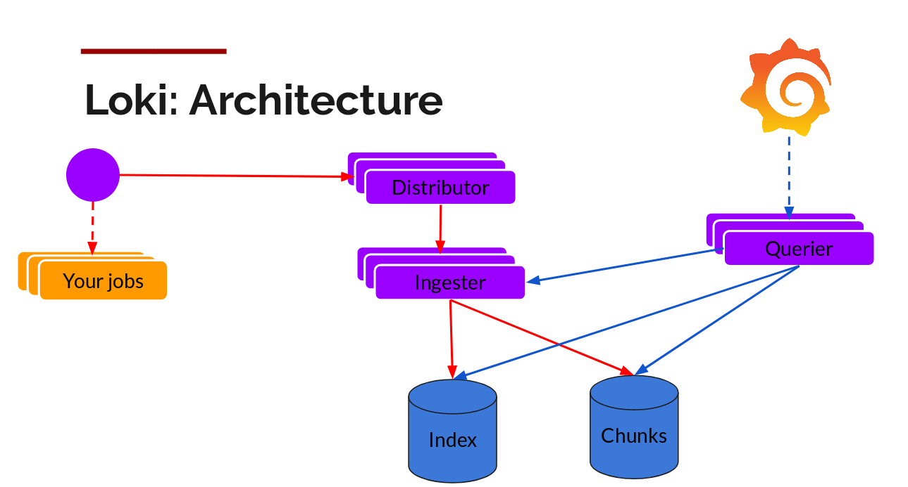

# Grafana

---

The open platform for beautiful analytics and monitoring (open source software for time series analytics) (Expression browser)

- 40 data sources
  - Graphite
  - Cloud watch
  - Prometheus
  - Elastic search
  - InfluxDB (TICK Stack)
  - Hosted Metrics
- 28 panels
- 17 apps
- 776 dashboards

```bash
docker run --rm --name=grafana --net=influxdb -p 3000:3000 grafana/grafana
docker run --rm --name=grafana -p 3000:3000 grafana/grafana
```

## Dashboards

- Telegraf System dashboard - <https://grafana.com/dashboards/928>
- Docker Overview - 5763
- Telegraf sysstats - 4823
- Kafka Overview - 721 prometheus
- Kafka Overview - 5484 kafka-exporter
- Prometheus 2.0 Overview - 3662
- Grafana Dashboard Exporter/Importer - 5837

<https://grafana.com/grafana/dashboards/5837>

- Blackbox Exporter status page dashboard - 5345
- HTTP - <https://grafana.com/grafana/dashboards/10138>
  - HTTP Metrics - <https://grafana.com/grafana/dashboards/73>
- Redis - <https://grafana.com/grafana/dashboards/763>

- **AWS Dashboards - <https://github.com/monitoringartist/grafana-aws-cloudwatch-dashboards>**

<https://grafana.com/docs/grafana/latest/datasources/cloudwatch>

- <https://grafana.com/blog/2021/11/09/announcing-grafana-oncall>

## Env

GF_AUTH_ANONYMOUS_ENABLED: true
GF_AUTH_ANONYMOUS_ORG_ROLE: Editor
GF_AUTH_BASIC_ENABLED: false
GF_SERVER_ENABLE_GZIP: true
GF_SERVER_ROOT_URL: ""
GF_EXTERNAL_IMAGE_STORAGE_PROVIDER: "s3"
GF_EXTERNAL_IMAGE_STORAGE_S3_ACCESS_KEY: "XXX"
GF_EXTERNAL_IMAGE_STORAGE_S3_BUCKET: "bucket"
GF_EXTERNAL_IMAGE_STORAGE_S3_REGION: "region"
GF_EXTERNAL_IMAGE_STORAGE_S3_SECRET_KEY: "XXX"
GF_PANELS_DISABLE_SANITIZE_HTML: true

## Concepts

- **Data Source**

Grafana supports many different storage backends for your time series data (Data Source). Each Data Source has a specific Query Editor that is customized for the features and capabilities that the particular Data Source exposes.

The following datasources are officially supported: [Graphite](http://docs.grafana.org/features/datasources/graphite/), [InfluxDB](http://docs.grafana.org/features/datasources/influxdb/), [OpenTSDB](http://docs.grafana.org/features/datasources/opentsdb/), [Prometheus](http://docs.grafana.org/features/datasources/prometheus/), [Elasticsearch](http://docs.grafana.org/features/datasources/elasticsearch/), [CloudWatch](http://docs.grafana.org/features/datasources/cloudwatch/).

The query language and capabilities of each Data Source are obviously very different. You can combine data from multiple Data Sources onto a single Dashboard, but each Panel is tied to a specific Data Source that belongs to a particular Organization.

- **Organization**
- **User**
- **Row**

A Row is a logical divider within a Dashboard, and is used to group Panels together.

Utilize the [Repeating Rows functionality](http://docs.grafana.org/reference/templating/#repeating-rows) to dynamically create or remove entire Rows (that can be filled with Panels), based on the Template variables selected.

Rows can be collapsed by clicking on the Row Title. If you save a Dashboard with a Row collapsed, it will save in that state and will not preload those graphs until the row is expanded.

- **Panel**

The Panel is the basic visualization building block in Grafana. Each Panel provides a Query Editor (dependent on the Data Source selected in the panel) that allows you to extract the perfect visualization to display on the Panel by utilizing the Query Editor

Types of Panel -

- Graph
- Singlestat
- Table
- Heatmap
- Alert list
- Dashboard list
- Text

Utilize the [Repeating Panel](http://docs.grafana.org/reference/templating/#repeating-panels) functionality to dynamically create or remove Panels based on the [Templating Variables](http://docs.grafana.org/reference/templating/#repeating-panels) selected.

- **Query Editor**

The Query Editor exposes capabilities of your Data Source and allows you to query the metrics that it contains.

Use the Query Editor to build one or more queries (for one or more series) in your time series database. The panel will instantly update allowing you to effectively explore your data in real time and build a perfect query for that particular Panel.

You can utilize [Template variables](http://docs.grafana.org/reference/templating/) in the Query Editor within the queries themselves. This provides a powerful way to explore data dynamically based on the Templating variables selected on the Dashboard.

Grafana allows you to reference queries in the Query Editor by the row that they're on. If you add a second query to graph, you can reference the first query simply by typing in #A. This provides an easy and convenient way to build compounded queries.

- **Dashboard**

The Dashboard is where it all comes together. Dashboards can be thought of as of a set of one or more Panels organized and arranged into one or more Rows.

The time period for the Dashboard can be controlled by the [Dashboard time picker](http://docs.grafana.org/reference/timerange/) in the upper right of the Dashboard.

Dashboards can utilize [Templating](http://docs.grafana.org/reference/templating/) to make them more dynamic and interactive.

Dashboards can utilize [Annotations](http://docs.grafana.org/reference/annotations/) to display event data across Panels. This can help correlate the time series data in the Panel with other events.

Dashboards (or a specific Panel) can be [Shared](http://docs.grafana.org/reference/sharing/) easily in a variety of ways. You can send a link to someone who has a login to your Grafana. You can use the [Snapshot](http://docs.grafana.org/reference/sharing/#snapshots) feature to encode all the data currently being viewed into a static and interactive JSON document; it's so much better than emailing a screenshot!

Dashboards can be tagged, and the Dashboard picker provides quick, searchable access to all Dashboards in a particular Organization.

## Advanced

- Variables
- Repeating Rows
- Repeating Panels

## Shortcuts

| **Global** |                                |
|------------|---------------------------------|
| gh         | Go to Home Dashboard            |
| gp         | Go to Profile                   |
| so         | Open search                     |
| ss         | Open search with starred filter |
| st         | Open search in tags view        |
| esc        | Exit edit/setting views         |

| **Dashboard** |  |
|---|---|
| mod+s | Save dashboard |
| dr | Refresh all panels |
| ds | Dashboard settings |
| dv | Toggle in-active / view mode |
| dk | Toggle kiosk mode (hides top nav) |
| dE | Expand all rows |
| dC | Collapse all rows |
| da | Toggle auto fit panels (experimental feature) |
| mod+o | Toggle shared graph crosshair |

| **Focused Panel** |                             |
|-------------------|------------------------------|
| e                 | Toggle panel edit view       |
| v                 | Toggle panel fullscreen view |
| ps                | Open Panel Share Modal       |
| pd                | Duplicate Panel              |
| pr                | Remove Panel                 |
| pl                | Toggle panel legend          |

| **Time Range** |                        |
|----------------|-------------------------|
| tz             | Zoom out time range     |
| t              | Move time range back    |
| t              | Move time range forward |

## Plugins

```bash
grafana-cli plugins list-remote
grafana-cli plugins install <plugin-id>
grafana-cli plugins install <plugin-id> <version>
grafana-cli plugins ls
```

<http://docs.grafana.org/guides/basic_concepts>

<https://play.grafana.org/d/ZvPm55mWk/new-features-in-v6-2?orgId=1>

<https://github.com/grafana/grafana>

## Grafana Loki

Loki is a horizontally-scalable, highly-available, multi-tenant log aggregation system inspired by [Prometheus](https://prometheus.io/). It is designed to be very cost effective and easy to operate. It does not index the contents of the logs, but rather a set of labels for each log stream.

Compared to other log aggregation systems, Loki:

- does not do full text indexing on logs. By storing compressed, unstructured logs and only indexing metadata, Loki is simpler to operate and cheaper to run.
- indexes and groups log streams using the same labels you're already using with Prometheus, enabling you to seamlessly switch between metrics and logs using the same labels that you're already using with Prometheus.
- is an especially good fit for storing [Kubernetes](https://kubernetes.io/) Pod logs. Metadata such as Pod labels is automatically scraped and indexed.
- has native support in Grafana (needs Grafana v6.0).

A Loki-based logging stack consists of 3 components:

- promtailis the agent, responsible for gathering logs and sending them to Loki.
- lokiis the main server, responsible for storing logs and processing queries.
- [Grafana](https://github.com/grafana/grafana) for querying and displaying the logs.

Loki is like Prometheus, but for logs: we prefer a multidimensional label-based approach to indexing, and want a single-binary, easy to operate system with no dependencies. Loki differs from Prometheus by focusing on logs instead of metrics, and delivering logs via push, instead of pull.

## PLG Stack (Promtail, Loki and Grafana)

Don't be surprised if you don't find this acronym, it is mostly known as Grafana Loki. Anyway, this stack is getting good popularity due to its opinionated design decisions. You might know about Grafana which is a popular visualization tool. Grafana labs designed **Loki** which is a horizontally scalable, highly available, multi-tenant log aggregation system inspired by Prometheus. It indexes only metadata and doesn't index the content of the log. This design decision makes it very cost-effective and easy to operate.

### Promtailis an agent that ships the logs from the local system to the Loki cluster.Grafanais the visualization tool which consumes data from Loki data sources


<https://grafana.com/docs/loki/latest/clients/promtail>

The Loki is built on the same design principles of Prometheus, therefore it is a good fit for storing and analyzing the logs of Kubernetes.

## Loki Architecture

Loki can be run in single-process mode or in multiple process mode providing independent horizontal scalability.


Loki is designed in a way that it can be used as a single monolith or can be used as microservice. The single-process model is good for local development and small monitoring setup. For production and scalable workload, it is recommended to go with the microservices model. The write path and read path in Loki are decoupled so it is highly tuneable and can be scaled independently based on the need.

Let's look into its logging architecture at high level with below diagram.


Below is the breakdown of the Loki (Microservice model).



## Components

### Promtail

This is the agent which is installed on the nodes (as Daemonset), it pulls the logs from the jobs and talks to Kubernetes API server to get the metadata and use this information to tag the logs. Then it forwards the log to Loki central service. The agents support the same labelling rules as Prometheus to make sure the metadata matches.

### Distributor

Promtail sends logs to the distributor which acts as a buffer. To handle millions of writes, it batches the inflow and compresses it in chunks as they come in. There are multiple ingesters, the logs belonging to each stream would end up in the same ingester for all relevant entries in the same chunk. This is done using the ring of ingesters and consistent hashing. To provide resiliency and redundancy, it doesn(default 3) times.

### Ingester

As the chunks come in, they are gzipped and appended with logs. Once the chunk fills up, the chunk is flushed to the database. The metadata goes into Index and log chunk data goes into Chunks (usually an Object store). After flushing, ingester creates a new chunk and add new entries in to that.


### Index

Index is the database like DynamoDB, Cassandra, Google Bigtable, etc.

### Chunks

Chunk of logs in a compressed format is stored in the object stores like S3

### Querier

This is in the read path and does all the heavy lifting. Given the time range and label selector, it looks at the index to figure out which are the matching chunks. Then it reads through those chunks and greps for the result.

### Storage

Unlike other logging systems, Loki is built around the idea of only indexing metadata about your logs: labels (just like Prometheus labels). Log data itself is then compressed and stored in chunks in object stores such as S3 or GCS, or even locally on the filesystem. A small index and highly compressed chunks simplifies the operation and significantly lowers the cost of Loki.

Loki 2.0 brings an index mechanism named 'boltdb-shipper' and is what we now call **Single Store Loki**. This index type only requires one store, the object store, for both the index and chunks.

<https://grafana.com/docs/loki/latest/storage>

<https://grafana.com/docs/loki/latest/operations/storage/boltdb-shipper>

<https://www.infracloud.io/logging-in-kubernetes-efk-vs-plg-stack>

<https://grafana.com/oss/loki>

<https://github.com/grafana/loki>

<https://grafana.com/go/webinar/observability-with-loki-2.0>

<https://grafana.com/go/webinar/intro-to-loki-like-prometheus-but-for-logs>

<https://grafana.com/docs/loki/latest/architecture>

<https://grafana.com/grafana/dashboards/13407>

<https://grafana.com/grafana/dashboards/10880>

<https://grafana.com/grafana/dashboards/10004>

<https://grafana.com/docs/loki/latest/operations/observability>

<https://grafana.com/blog/2020/10/28/loki-2.0-released-transform-logs-as-youre-querying-them-and-set-up-alerts-within-loki>

## LogQL

Loki comes with its own PromQL-inspired language for queries called **LogQL**. LogQL can be considered a distributed **grep** that aggregates log sources. LogQL uses labels and operators for filtering.

There are two types of LogQL queries:

- **Log queries** return the contents of log lines.
- **Metric queries** extend log queries and calculate sample values based on the content of logs from a log query.

<https://grafana.com/docs/loki/latest/logql/metric_queries>

## Examples

```bash
{container="decision-engine"} != "get_device_sms_score" |= "get_device_sms"
|= "2985892"
rate({app="reminder-messages-sms-consumer"}[5m])
```

<https://grafana.com/docs/loki/latest/logql>
