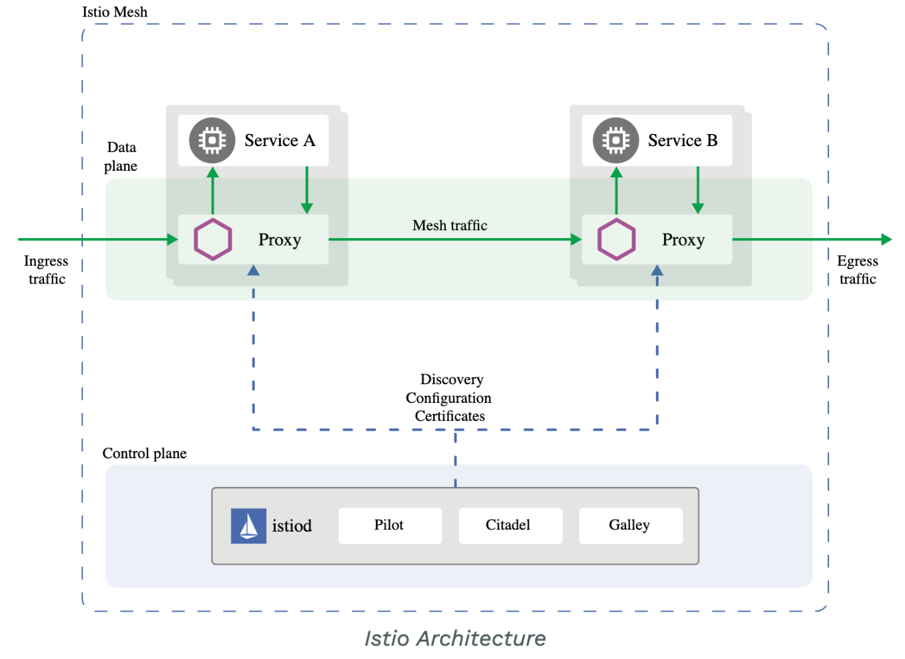

# Architecture

Created: 2019-12-17 12:34:00 +0500

Modified: 2020-06-05 20:38:56 +0500

---

Istio works by having a small network proxy sit alongside each microservice. This so-called "sidecar" intercepts all of the service's traffic, and handles it more intelligently than a simple layer 3 network can. Istio uses the[Envoy](https://www.envoyproxy.io/)proxy as its sidecar. Envoy was originally written at Lyft and is now a[CNCF project](https://landscape.cncf.io/). The whole set of sidecars, one per microservice, is called the*data plane*. The work of the sidecars is coordinated by a small number of central components called the*control plane*. Control and data plane architectures are very common in distributed systems, from network switches to compute farms.

After deploying Istio in a Kubernetes cluster, Istio takes over the communication between services with sidecar proxies. The communication between services is no longer through Kube-proxy but through Istio's sidecar proxies. The request process is like this: First, a client request is captured and redirected to the sidecar proxy by iptables. Then, the sidecar proxy chooses a backend pod according to the service discovery information and routing rules obtained from the control plane, and forwards the request to it.

An Istio service mesh is logically split into adata planeand acontrol plane.
-   Thedata planeis composed of a set of intelligent proxies ([Envoy](https://www.envoyproxy.io/)) deployed as sidecars. These proxies mediate and control all network communication between microservices along with[Mixer](https://istio.io/docs/reference/config/policy-and-telemetry/), a general-purpose policy and telemetry hub.
-   Thecontrol planemanages and configures the proxies to route traffic. Additionally, the control plane configures Mixers to enforce policies and collect telemetry.

The following diagram shows the different components that make up each plane:

Traffic in Istio is categorized as data plane traffic and control plane traffic. Data plane traffic refers to the messages that the business logic of the workloads send and receive. Control plane traffic refers to configuration and control messages sent between Istio components to program the behavior of the mesh. Traffic management in Istio refers exclusively to data plane traffic.

<https://istio.io/docs/ops/deployment/architecture

Istio is composed of these components:
-   **Envoy**

Sidecar proxies per microservice to handle ingress/egress traffic between services in the cluster and from a service to external services. The proxies form asecure microservice meshproviding a rich set of functions like discovery, rich layer-7 routing, circuit breakers, policy enforcement and telemetry recording/reporting functions.

Note: The service mesh is not an overlay network. It simplifies and enhances how microservices in an application talk to each other over the network provided by the underlying platform.
-   **Mixer**

Central component that is leveraged by the proxies and microservices to enforce policies such as authorization, rate limits, quotas, authentication, request tracing and telemetry collection.
-   **Pilot**

A component responsible for configuring the proxies at runtime.
-   **Citadel**

A centralized component responsible for certificate issuance and rotation.
-   **Node Agent**

A per-node component responsible for certificate issuance and rotation.
-   **Galley**

Central component for validating, ingesting, aggregating, transforming and distributing config within Istio.

**Concepts**

**Policies**

Istio lets you configure custom policies for your application to enforce rules at runtime such as:
-   Rate limiting to dynamically limit the traffic to a service
-   Denials, whitelists, and blacklists, to restrict access to services
-   Header rewrites and redirects

Istio also lets you create your own[policy adapters](https://istio.io/docs/tasks/policy-enforcement/control-headers)to add, for example, your own custom authorization behavior.

**Platform support**

Istio is platform-independent and designed to run in a variety of environments, including those spanning Cloud, on-premise, Kubernetes, Mesos, and more. You can deploy Istio on Kubernetes, or on Nomad with Consul. Istio currently supports:
-   Service deployment on Kubernetes
-   Services registered with Consul
-   Services running on individual virtual machines

**References**

<https://istio.io/docs/concepts/what-is-istio

**Ingress Routing**

1.  A client makes a request on a specific port.

2.  TheLoad Balancerlistens on this port and forwards the request to one of the workers in the cluster (on the same or a new port).

3.  Inside the cluster the request is routed to theIstio IngressGateway Servicewhich is listening on the port the load balancer forwards to.

4.  TheServiceforwards the request (on the same or a new port) to anIstio IngressGateway Pod(managed by a Deployment).

5.  TheIngressGateway Podis configured by aGateway(!) and aVirtualService.

6.  TheGatewayconfigures the ports, protocol, and certificates.

7.  TheVirtualServiceconfigures routing information to find the correctService

8.  TheIstio IngressGateway Podroutes the request to theapplication Service.

9.  And finally, theapplication Serviceroutes the request to anapplication Pod(managed by a deployment).

