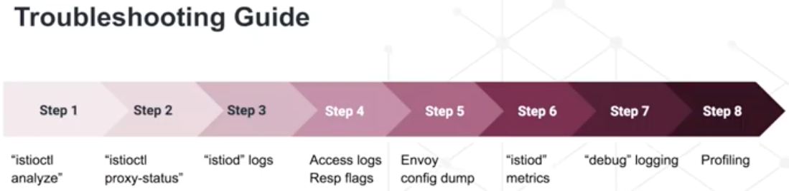

# Commands

Created: 2019-12-17 14:31:05 +0500

Modified: 2021-09-19 01:04:39 +0500

---

curl -L <https://istio.io/downloadIstio> | sh - #installing istioctl

brew install istioctl

istioctl manifest apply --set profile=demo

kubectl label namespace default istio-injection=enabled

kubectl get VirtualService --all-namespaces

kubectl get DestinationRule --all-namespaces

istioctl x precheck #pre flight checks before installing istio

istioctl verify-install

istioctl proxy-status

istioctl analyze --timeout 60s

istioctl analyze -L

annotations:

sidecar.istio.io/proxyCPU: "10m"

sidecar.istio.io/proxyMemory: "50Mi"

sidecar.istio.io/inject: "false"

<https://istio.io/latest/docs/reference/commands/istioctl>
