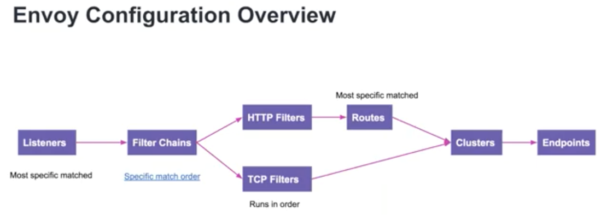
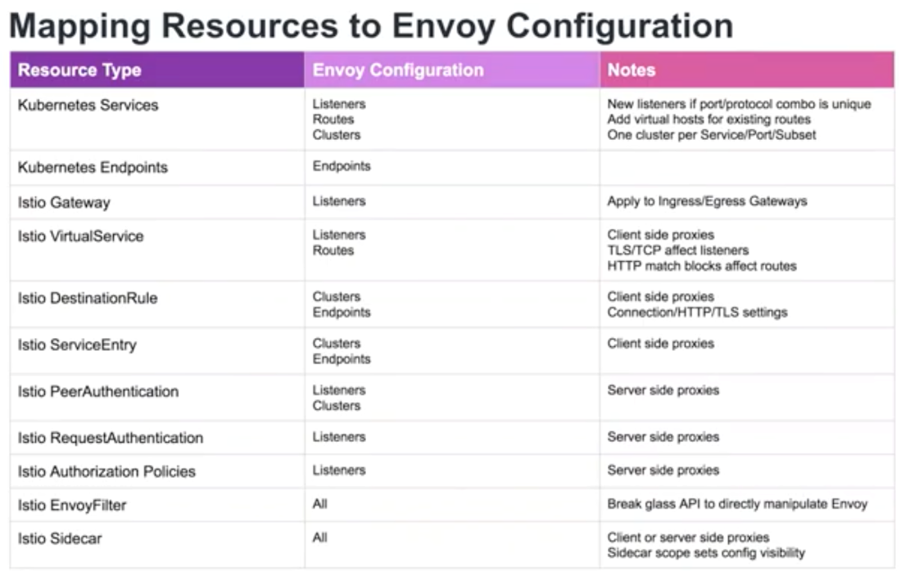
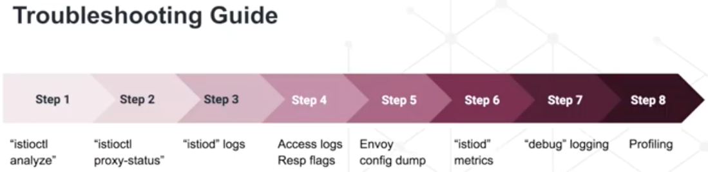

# Others

Created: 2020-06-05 13:10:37 +0500

Modified: 2021-07-22 10:02:34 +0500

---

## Istio Ingress vs Kubernetes Ingress

![c:iææ:::] Servee (L'NdBaarrer) DNS. Traditional Istio I rwessCo n role r tÜSt (name) baed routig co#uræ TLS nne basai route (LcRdB*arEer) r&rmces DNS. LC*d Baenc« cor#uræ Isto Ingræs Gatavay (Envoy) TL S seaet Gateway md MrtuaService must exSt and tEfore Envoy End;X'iMs • • • " • tack assocüted pod Envoy App ](../../../media/DevOps-Monitoring-Others-image1.png)

## Automatic Reconfiguration

<https://software.danielwatrous.com/istio-ingress-vs-kubernetes-ingress

[**https://medium.com/@zhaohuabing/which-one-is-the-right-choice-for-the-ingress-gateway-of-your-service-mesh-21a280d4a29c**](https://medium.com/@zhaohuabing/which-one-is-the-right-choice-for-the-ingress-gateway-of-your-service-mesh-21a280d4a29c)

## Shared Control Plane

<https://istio.io/docs/setup/install/multicluster/shared

## Access Log

Default turn off, only on in demo profile
-   Can be enabled globally or per namespace too

kubectl describe cm istio -n istio-system

![Globally Enabling Access Logs Globally enabling using "istioctl install" istioctl install ---set profile-deno ------set Globally customizing encoding which defaults to "TEXT istiocti install ------set profile---demo ------set Reverting back to no access log istiocti instati ------set profile-deno ------set meshConfig.aecessLogFiie=•• ------set This configuration is stored in "istio" configmap as default "mesh" configuration kubecti ---n istio---system get cm istio ---o yami I grep accessLog accessLogEneoding: TEXT accessLogFiie: • accessLogFormat: ](../../../media/DevOps-Monitoring-Others-image4.png)

[Webinar: Debugging your debugging tools; What to do when your service mesh goes down in production?](https://www.youtube.com/watch?v=XAKY24b7XjQ)

## Production Istio Installation
-   Metrics & logs from control & data plane
    -   Setup alerts
-   Enable access logs
-   Outbound traffic control
-   Strint mTLS instead of "auto"
-   Scale out control plane
    -   Configure HPA
    -   Configure pod anti-affinity
-   Non self signed CA certificates
-   Locking down ingress GW ports
-   Auto sidecar injection
-   Production grade Prometheus & Jaeger
