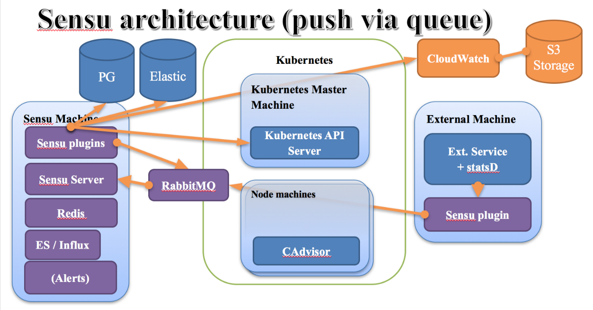
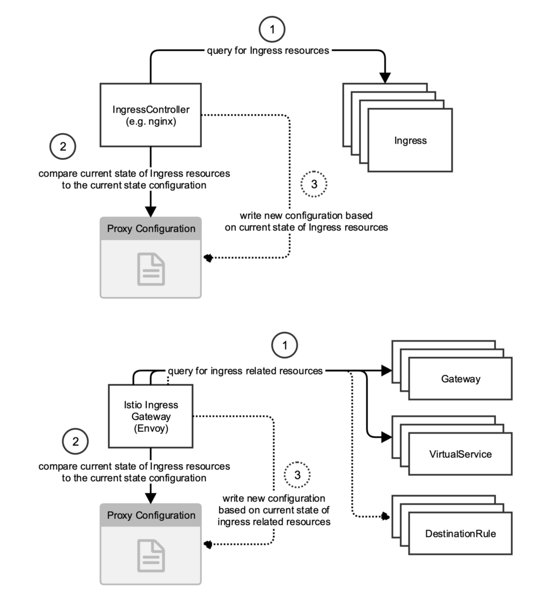
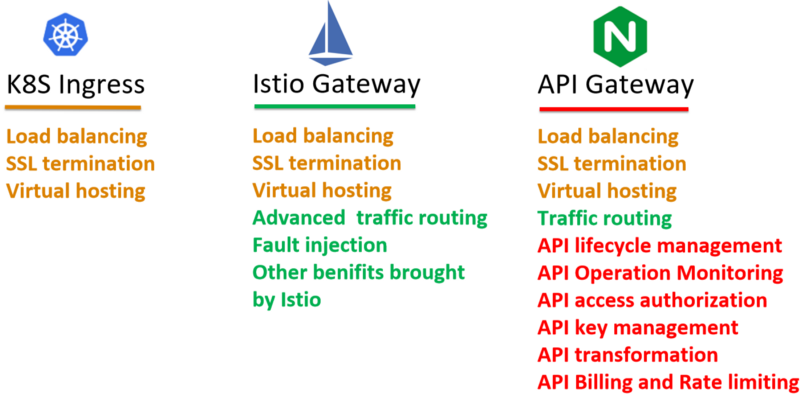
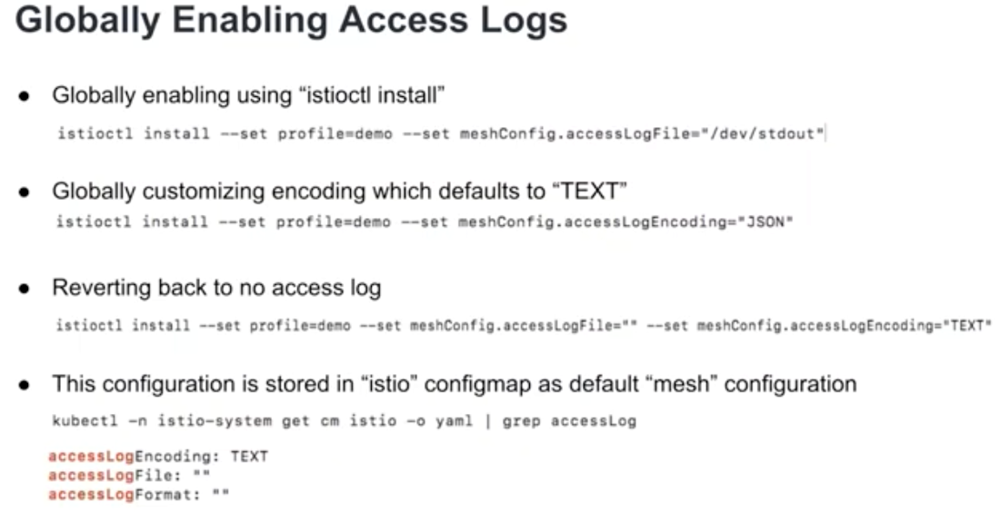
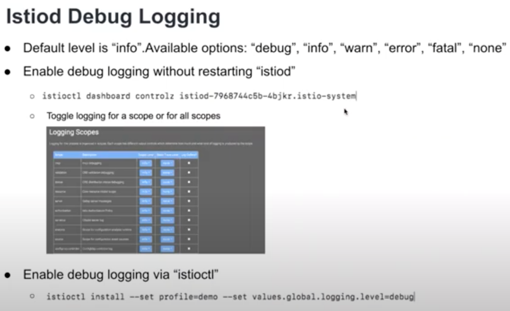

# Others

Created: 2020-06-05 13:10:37 +0500

Modified: 2021-07-22 10:02:34 +0500

---

## Istio Ingress vs Kubernetes Ingress

## Automatic Reconfiguration

<https://software.danielwatrous.com/istio-ingress-vs-kubernetes-ingress>

[**https://medium.com/@zhaohuabing/which-one-is-the-right-choice-for-the-ingress-gateway-of-your-service-mesh-21a280d4a29c**](https://medium.com/@zhaohuabing/which-one-is-the-right-choice-for-the-ingress-gateway-of-your-service-mesh-21a280d4a29c)

## Shared Control Plane

<https://istio.io/docs/setup/install/multicluster/shared>

## Access Log

Default turn off, only on in demo profile

- Can be enabled globally or per namespace too

kubectl describe cm istio -n istio-system

[Webinar: Debugging your debugging tools; What to do when your service mesh goes down in production?](https://www.youtube.com/watch?v=XAKY24b7XjQ)

## Production Istio Installation

- Metrics & logs from control & data plane
  - Setup alerts
- Enable access logs
- Outbound traffic control
- Strint mTLS instead of "auto"
- Scale out control plane
  - Configure HPA
  - Configure pod anti-affinity
- Non self signed CA certificates
- Locking down ingress GW ports
- Auto sidecar injection
- Production grade Prometheus & Jaeger
