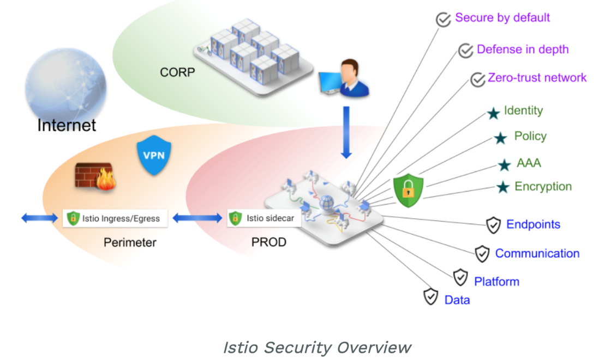
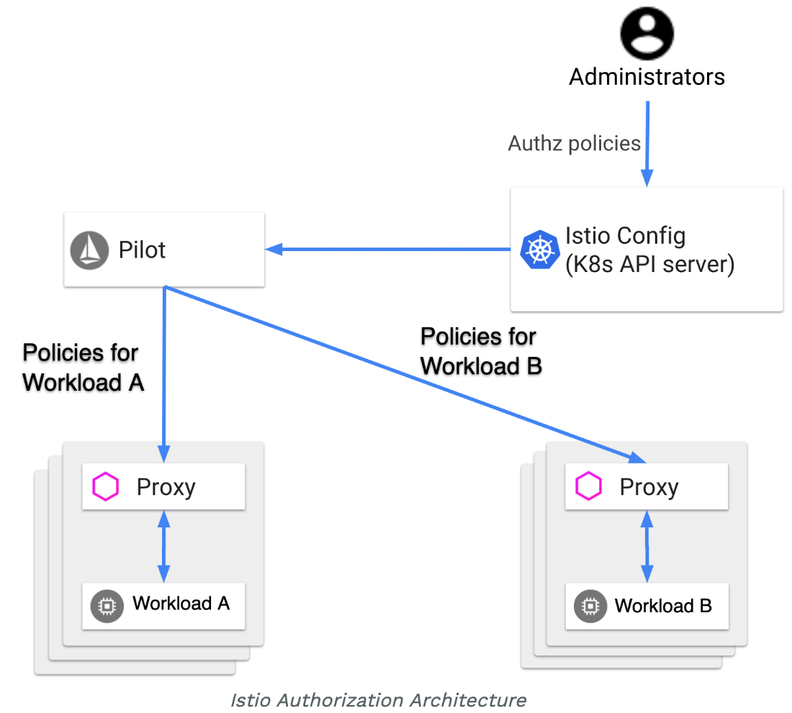

# Security

---

Istio's security capabilities free developers to focus on security at the application level. Istio provides the underlying secure communication channel, and manages authentication, authorization, and encryption of service communication at scale. With Istio, service communications are secured by default, letting you enforce policies consistently across diverse protocols and runtimes -- all with little or no application changes.

While Istio is platform independent, using it with Kubernetes (or infrastructure) network policies, the benefits are even greater, including the ability to securepod-to-pod or service-to-service communication at the network and application layers.

The Istio security features provide strong identity, powerful policy, transparent TLS encryption, and authentication, authorization and audit (AAA) tools to protect your services and data. The goals of Istio security are:

- **Security by default:** no changes needed for application code and infrastructure
- **Defense in depth:** integrate with existing security systems to provide multiple layers of defense
- **Zero-trust network:** build security solutions on untrusted networks

Why zero trust network because if there is a single compromised node in the VPC then the whole network is compromised

## High-level architecture

Security in Istio involves multiple components:

- A Certificate Authority (CA) for key and certificate management
- The configuration API server distributes to the proxies:
  - [authentication policies](https://istio.io/docs/concepts/security/#authentication-policies)
  - [authorization policies](https://istio.io/docs/concepts/security/#authorization-policies)
  - [secure naming information](https://istio.io/docs/concepts/security/#secure-naming)
- Sidecar and perimeter proxies work as [Policy Enforcement Points](https://www.jerichosystems.com/technology/glossaryterms/policy_enforcement_point.html)(PEPs) to secure communication between clients and servers.
- A set of Envoy proxy extensions to manage telemetry and auditing

## Authentication

Istio provides two types of authentication:

- **Transport authentication**, also known asservice-to-service authentication: verifies the direct client making the connection. Istio offers [mutual TLS](https://en.wikipedia.org/wiki/Mutual_authentication) as a full stack solution for transport authentication. You can easily turn on this feature without requiring service code changes. This solution:
  - Provides each service with a strong identity representing its role to enable interoperability across clusters and clouds.
  - Secures service-to-service communication and end-user-to-service communication.
  - Provides a key management system to automate key and certificate generation, distribution, and rotation.
- **Origin authentication**, also known asend-user authentication: verifies the original client making the request as an end-user or device. Istio enables request-level authentication with JSON Web Token (JWT) validation and a streamlined developer experience for open source OpenID Connect provider [ORY Hydra](https://www.ory.sh/), [Keycloak](https://www.keycloak.org/), [Auth0](https://auth0.com/), [Firebase Auth](https://firebase.google.com/docs/auth/), [Google Auth](https://developers.google.com/identity/protocols/OpenIDConnect), and custom auth.

In both cases, Istio stores the authentication policies in theIstio config storevia a custom Kubernetes API. Pilot keeps them up-to-date for each proxy, along with the keys where appropriate. Additionally, Istio supports authentication in permissive mode to help you understand how a policy change can affect your security posture before it becomes effective.

- Mutual TLS Authentication
- Permissive mode
- Secure naming
- Authentication architecture
- Authentication policies
- Policy storage scope
- Target selectors
- Principal binding
- Updating authentication policies

## Authorization

Istio's authorization feature provides mesh-level, namespace-level, and workload-level access control on workloads in an Istio Mesh. It provides:

- Workload-to-workload and end-user-to-workload authorization.
- A Simple API, it includes a single [AuthorizationPolicyCRD](https://istio.io/docs/reference/config/security/authorization-policy/), which is easy to use and maintain.
- Flexible semantics, operators can define custom conditions on Istio attributes.
- High performance, as Istio authorization is enforced natively on Envoy.
- High compatibility, supports HTTP, HTTPS and HTTP2 natively, as well as any plain TCP protocols.

## Authorization Architecture

- Implicit enablement
- Authorization policy
- Policy target
- Value matching
- Allow-all and deny-all
- Custom conditions
- Authenticated and unauthenticated identity
- Using istio authorization on plain TCP protocols

<https://istio.io/docs/concepts/security>
