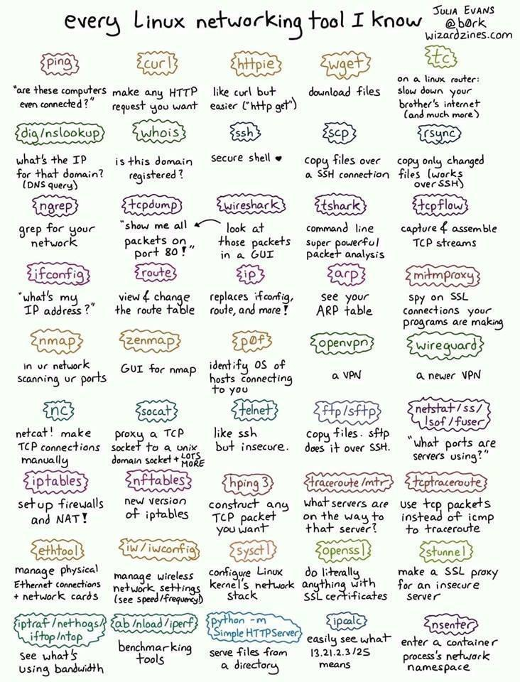

# Networking tools

Created: 2020-02-13 20:03:01 +0500

Modified: 2022-01-07 15:29:44 +0500

---

<https://haydenjames.io/linux-networking-commands-scripts>

1. [aria2](https://aria2.github.io/)--downloading just about everything. Torrents included.

2. [arpwatch](https://linux.die.net/man/8/arpwatch)--Ethernet Activity Monitor.

3. [bmon](https://github.com/tgraf/bmon)--bandwidth monitor and rate estimator.

4. [bwm-ng](https://www.gropp.org/?id=projects&sub=bwm-ng)--live network bandwidth monitor.

5. [curl](https://curl.haxx.se/)--transferring data with URLs. (or try [httpie](https://httpie.org/))

6. [darkstat](https://unix4lyfe.org/darkstat/)-- captures network traffic, usage statistics.

7. [dhclient](https://linux.die.net/man/8/dhclient)-- Dynamic Host Configuration Protocol Client

8. [dig](https://linux.die.net/man/1/dig)--query DNS servers for information.

9. [dstat](https://github.com/dagwieers/dstat)--replacement for vmstat, iostat, mpstat, netstat and ifstat.

10. [ethtool](https://mirrors.edge.kernel.org/pub/software/network/ethtool/)--utility for controlling network drivers and hardware.

11. [gated](https://www.oreilly.com/library/view/linux-in-a/0596000251/re101.html)-- gateway routing daemon.

12. [host](https://linux.die.net/man/1/host)-- DNS lookup utility.

13. [hping](http://www.hping.org/)-- TCP/IP packet assembler/analyzer.

14. [ibmonitor](http://ibmonitor.sourceforge.net/)--shows bandwidth and total data transferred.

15. [ifstat](http://gael.roualland.free.fr/ifstat/)--report network interfaces bandwidth.

16. [iftop](http://www.ex-parrot.com/pdw/iftop/)-- display bandwidth usage.

17. [ip](https://access.redhat.com/sites/default/files/attachments/rh_ip_command_cheatsheet_1214_jcs_print.pdf)(PDF file) --acommandwith more features that ifconfig (net-tools).

18. [iperf3](https://github.com/esnet/iperf)-- network bandwidth measurement tool

19. [iproute2](https://wiki.linuxfoundation.org/networking/iproute2)--collection of utilities for controllingTCP/IP.

20. [iptables](https://netfilter.org/)-- take control of network traffic.

21. [IPTraf](http://iptraf.seul.org/)-- An IP Network Monitor.

22. [iputils](https://wiki.linuxfoundation.org/networking/iputils)--set of small useful utilities for Linux networking.

23. [iw](https://wireless.wiki.kernel.org/en/users/documentation/iw)-- a newnl80211based CLI configuration utility for wireless devices.

24. [jwhois](https://www.gnu.org/software/jwhois/)(whois) --client for the whois service.

25. ["lsof -i"](https://www.novell.com/coolsolutions/tip/18078.html)-- reveal information about your network sockets.

26. [mtr](http://www.bitwizard.nl/mtr/)--network diagnostic tool.

27. [net-tools](http://net-tools.sourceforge.net/)-- utilities include: arp, hostname, ifconfig, [netstat](http://net-tools.sourceforge.net/man/netstat.8.html), rarp, route, plipconfig, slattach, mii-tool, iptunnel and ipmaddr.

28. [ncat](https://nmap.org/ncat/)--improved re-implementation of the venerable netcat.

29. [netcat](http://nc110.sourceforge.net/)-- networking utility for reading/writing network connections.

30. [nethogs](https://github.com/raboof/nethogs)--a small 'net top' tool.

31. [Netperf](https://github.com/HewlettPackard/netperf)-- Network bandwidth Testing.

32. [netplan](https://netplan.io/)--Netplan is a utility for easily configuring networking on a linux system.

33. [netsniff-ng](http://netsniff-ng.org/)-- Swiss army knife for daily Linux network plumbing.

34. [netwatch](http://www.slctech.org/~mackay/NETWATCH/netwatch.html)--monitoring Network Connections.

35. [ngrep](https://github.com/jpr5/ngrep/)--grep applied to the network layer.

36. [nload](https://linux.die.net/man/1/nload)-- display network usage.

37. [nmap](https://nmap.org/)--network discovery and security auditing.

38. [nmcli](https://developer.gnome.org/NetworkManager/stable/nmcli.html)--a command-line tool for controlling NetworkManager and reporting network status.

39. [nmtui](https://access.redhat.com/documentation/en-US/Red_Hat_Enterprise_Linux/7/html/Networking_Guide/sec-Networking_Config_Using_nmtui.html)--provides a text interface to configure networking by controllingNetworkManager.

40. [nslookup](https://en.wikipedia.org/wiki/Nslookup)--query Internet name servers interactively.

41. [ping](https://en.wikipedia.org/wiki/Ping_(networking_utility))--send icmp echo_request to network hosts.

42. [route](https://en.wikipedia.org/wiki/Route_(command))--show / manipulate the IP routing table.

43. [slurm](https://github.com/mattthias/slurm)-- network load monitor.

44. [snort](https://www.snort.org/)-- Network Intrusion Detection and Prevention System.

45. [smokeping](https://oss.oetiker.ch/smokeping/)--keeps track of your network latency.

46. [socat](http://www.dest-unreach.org/socat/)--establishes two bidirectional byte streams and transfers data between them.

47. [speedometer](http://excess.org/speedometer/)--Measure and display the rate of data across a network.

48. [speedtest-cli](https://github.com/sivel/speedtest-cli)-- test internet bandwidth using speedtest.net

49. [ss](http://linux-ip.net/gl/ss/)--utility to investigate sockets.

50. [ssh](https://www.ssh.com/ssh/)--secure system administration and file transfers over insecure networks.

51. [tcpdump](https://www.tcpdump.org/)--command-line packet analyzer.

52. [tcptrack](https://github.com/bchretien/tcptrack)-- Displays information about tcp connections on a network interface.

53. [telnet](https://www.unix.com/man-page/linux/1/telnet/)--user interface to the TELNET protocol.

54. [tracepath](https://linux.die.net/man/8/tracepath)--very similar function to traceroute.

55. [traceroute](http://traceroute.sourceforge.net/)--print the route packets trace to network host.

56. [vnStat](https://humdi.net/vnstat/)-- network traffic monitor.

57. [websocat](https://github.com/vi/websocat)-- Connection forwarder from/to web sockets to/from usual sockets, in style of socat.

58. [wget](https://www.gnu.org/software/wget/)--retrieving files using HTTP, HTTPS, FTP and FTPS.

59. [Wireless Tools for Linux](https://hewlettpackard.github.io/wireless-tools/Tools.html)-- includesiwconfig,iwlist,iwspy,iwpriv andifrename.

60. [Wireshark](https://www.wireshark.org/)--network protocol analyzer.

61. FRP - A fast reverse proxy to help you expose a local server behind a NAT or firewall to the internet.

<https://github.com/fatedier/frp>

## magic-wormhole

get things from one computer to another, safely

brew install magic-wormhole

wormhole send /path/to/file

wormhole receive 4-yucatan-reform

<https://github.com/magic-wormhole/magic-wormhole>
