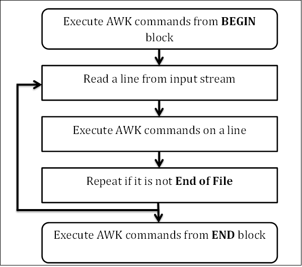

# AWK

Created: 2018-09-24 13:16:54 +0500

Modified: 2020-05-11 17:55:32 +0500

---

**man awk - pattern-directed scanning and processing language**

**AWK**is a[programming language](https://en.wikipedia.org/wiki/Programming_language)designed for text processing and typically used as a[data extraction](https://en.wikipedia.org/wiki/Data_extraction)and reporting tool. It is a standard feature of most[Unix-like](https://en.wikipedia.org/wiki/Unix-like)[operating systems](https://en.wikipedia.org/wiki/Operating_system).

The AWK language is a[data-driven](https://en.wikipedia.org/wiki/Data-driven_programming)[scripting language](https://en.wikipedia.org/wiki/Scripting_language)consisting of a set of actions to be taken against[streams](https://en.wikipedia.org/wiki/Stream_(computing))of textual data -- either run directly on files or used as part of a[pipeline](https://en.wikipedia.org/wiki/Pipeline_(Unix))-- for purposes of extracting or transforming text, such as producing formatted reports. The language extensively uses the[string](https://en.wikipedia.org/wiki/String_(computer_science))[datatype](https://en.wikipedia.org/wiki/Datatype),[associative arrays](https://en.wikipedia.org/wiki/Associative_array)(that is, arrays indexed by key strings), and[regular expressions](https://en.wikipedia.org/wiki/Regular_expression). While AWK has a limited intended[application domain](https://en.wikipedia.org/wiki/Application_domain)and was especially designed to support[one-liner programs](https://en.wikipedia.org/wiki/One-liner_program), the language is[Turing-complete](https://en.wikipedia.org/wiki/Turing-complete), and even the early Bell Labs users of AWK often wrote well-structured large AWK programs.

AWK was created at[Bell Labs](https://en.wikipedia.org/wiki/Bell_Labs)in the 1970s,[^[3]^](https://en.wikipedia.org/wiki/AWK#cite_note-3)and its name is derived from the[surnames](https://en.wikipedia.org/wiki/Surname)of its authors---[Alfred Aho](https://en.wikipedia.org/wiki/Alfred_Aho),[Peter Weinberger](https://en.wikipedia.org/wiki/Peter_J._Weinberger), and[Brian Kernighan](https://en.wikipedia.org/wiki/Brian_Kernighan).

"**AWK**is a language for processing text files. A file is treated as a sequence of records, and by default each line is a record. Each line is broken up into a sequence of fields, so we can think of the first word in a line as the first field, the second word as the second field, and so on.**An AWK program is a sequence of pattern-action statements**. AWK reads the input a line at a time. A line is scanned for each pattern in the program, and for each pattern that matches, the associated action is executed." - Alfred V. Aho

**Structure of AWK Program**

An AWK program is a series of pattern action pairs, written as:

condition { action }
condition { action }
...

where*condition*is typically an expression and*action*is a series of commands. The input is split into records, where by default records are separated by newline characters so that the input is split into lines. The program tests each record against each of the conditions in turn, and executes the*action*for each expression that is true. Either the*condition*or the*action*may be omitted. The*condition*defaults to matching every record. The default*action*is to print the record. This is the same pattern-action structure as sed.

In addition to a simple AWK expression, such asfoo == 1or/^foo/, the*condition*can beBEGINorENDcausing the*action*to be executed before or after all records have been read, or*pattern1, pattern2*which matches the range of records starting with a record that matches*pattern1*up to and including the record that matches*pattern2*before again trying to match against*pattern1*on future lines.

**Idea behind AWK Programming**

**Event-based Programming**

In a normal procedural shell script or command line session, you're telling the computer to do a sequence of things in a specific order. That's not how AWK works. In AWK, you tell the computer how to look for events, and then tell it what to do when it finds an event you're interested in.

Let's take another look at that AWK program. This time, I'll format it a bit more nicely:

/oatmeal/ {
print $1 ": featuring " $3;
}

The first part of this program ---/oatmeal/ ---is theeventthat you're looking for. Events can be specified in a few different ways: you can use a C-style conditional expression, or a special event like BEGIN that is triggered before the first line is read. However, the most common kind of event to see is a regular expression event, which is what /oatmeal/ is. If "oatmeal" appears in a line of text, then our event will be triggered.

The action is the second part of this program, the part between the braces. This part is a procedural set of instructions to perform when your event occurs. Here, you have a small C-like programming language at your disposal, with for/while loops, if statements, and global variables at your disposal.

When AWK runs your program, it will read each line of input in, one after the other. Each time it reads in a line, it will see if your event occurred. If it has, then it performs your event's action. You can define as many events as you like. If more than one event occurs, each event's action is performed in the order they appear in your program.

## AWK Workflow

To become an expert AWK programmer, you need to know its internals. AWK follows a simple workflow − Read, Execute, and Repeat. The following diagram depicts the workflow of AWK −

**Read**

AWK reads a line from the input stream (file, pipe, or stdin) and stores it in memory.

**Execute**

All AWK commands are applied sequentially on the input. By default AWK execute commands on every line. We can restrict this by providing patterns.

**Repeat**

This process repeats until the file reaches its end.

## Program Structure

Let us now understand the program structure of AWK.

**BEGIN block**

BEGIN {awk-commands}

The BEGIN block gets executed at program start-up. It executes only once. This is good place to initialize variables. BEGIN is an AWK keyword and hence it must be in upper-case. Please note that this block is optional.

**Body Block**

/pattern/ {awk-commands}

The body block applies AWK commands on every input line. By default, AWK executes commands on every line. We can restrict this by providing patterns. Note that there are no keywords for the Body block.

**END Block**

END {awk-commands}

The END block executes at the end of the program. END is an AWK keyword and hence it must be in upper-case. Please note that this block is optional.

At the start, AWK prints the header from the BEGIN block. Then in the body block, it reads a line from a file and executes AWK's print command which just prints the contents on the standard output stream. This process repeats until file reaches the end.

**Examples**

docker images | awk '{print $3}'

docker images | awk '{print "docker rmi " $1":"$2}'

ls -l | awk '{print $1}'

kubectl get pods | awk '{if (NR!=1) { print $1 }}'

# pass values to another command recursively

k delete pv $(k get pv | grep Released | awk '{print $1}')

**References**

<https://en.wikipedia.org/wiki/AWK>

<https://www.bignerdranch.com/blog/a-crash-course-in-awk

<http://www.grymoire.com/Unix/Awk.html>

<https://www.tutorialspoint.com/awk

