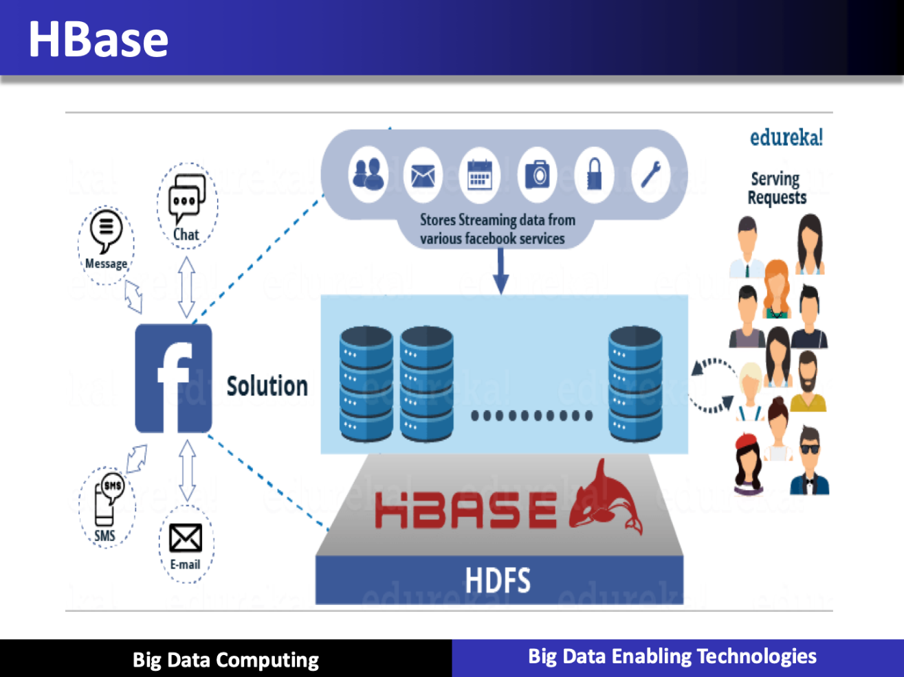

# Apache HBase

Created: 2018-09-08 19:09:29 +0500

Modified: 2020-02-29 10:11:38 +0500

---

HBaseis an[open-source](https://en.wikipedia.org/wiki/Open-source),[non-relational](https://en.wikipedia.org/wiki/Non-relational_database),[distributed database](https://en.wikipedia.org/wiki/Distributed_database)modeled after[Google's](https://en.wikipedia.org/wiki/Google)[Bigtable](https://en.wikipedia.org/wiki/Bigtable)and written in[Java](https://en.wikipedia.org/wiki/Java_(programming_language)). It is developed as part of[Apache Software Foundation](https://en.wikipedia.org/wiki/Apache_Software_Foundation)'s[Apache Hadoop](https://en.wikipedia.org/wiki/Hadoop)project and runs on top of[HDFS (Hadoop Distributed File System)](https://en.wikipedia.org/wiki/Hadoop_Distributed_File_System), providing Bigtable-like capabilities for Hadoop. That is, it provides a[fault-tolerant](https://en.wikipedia.org/wiki/Fault-tolerant)way of storing large quantities of[sparse](https://en.wikipedia.org/wiki/Sparse_file)data (small amounts of information caught within a large collection of empty or unimportant data, such as finding the 50 largest items in a group of 2 billion records, or finding the non-zero items representing less than 0.1% of a huge collection).

HBase features compression, in-memory operation, and[Bloom filters](https://en.wikipedia.org/wiki/Bloom_filter)on a per-column basis as outlined in the original Bigtable paper.Tables in HBase can serve as the input and output for[MapReduce](https://en.wikipedia.org/wiki/Mapreduce)jobs run in Hadoop, and may be accessed through the Java API but also through [REST](https://en.wikipedia.org/wiki/REST), [Avro](https://en.wikipedia.org/wiki/Avro_(serialization_system)) or [Thrift](https://en.wikipedia.org/wiki/Thrift_(protocol)) gateway APIs. HBase is a column-oriented key-value data store and has been idolized widely because of its lineage with Hadoop and HDFS. HBase runs on top of HDFS and is well-suited for faster read and write operations on large datasets with high throughput and low input/output latency.

HBase is not a direct replacement for a classic[SQL](https://en.wikipedia.org/wiki/SQL)[database](https://en.wikipedia.org/wiki/Database), however[Apache Phoenix](https://en.wikipedia.org/wiki/Apache_Phoenix)project provides a SQL layer for HBase as well as[JDBC](https://en.wikipedia.org/wiki/JDBC)driver that can be integrated with various[analytics](https://en.wikipedia.org/wiki/Analytics)and[business intelligence](https://en.wikipedia.org/wiki/Business_intelligence)applications. The[Apache Trafodion](https://en.wikipedia.org/wiki/Apache_Trafodion)project provides a SQL query engine with[ODBC](https://en.wikipedia.org/wiki/ODBC)and[JDBC](https://en.wikipedia.org/wiki/JDBC)drivers and[distributed ACID transaction protection](https://en.wikipedia.org/wiki/ACID#Distributed_transactions)across multiple statements, tables and rows that uses HBase as a storage engine.

Unlike relational and traditional databases, HBase does not support SQL scripting; instead the equivalent is written in Java, employing similarity with a MapReduce application.

In the parlance of Eric Brewer's[CAP Theorem](https://en.wikipedia.org/wiki/CAP_Theorem), HBase is a CP type system.

Use Apache HBase™ when you need random, realtime read/write access to your Big Data. This project's goal is the hosting of very large tables -- billions of rows X millions of columns -- atop clusters of commodity hardware. Apache HBase is an open-source, distributed, versioned, non-relational database modeled after Google's[Bigtable: A Distributed Storage System for Structured Data](http://research.google.com/archive/bigtable.html)by Chang et al. Just as Bigtable leverages the distributed data storage provided by the Google File System, Apache HBase provides Bigtable-like capabilities on top of Hadoop and HDFS.

Features
-   Linear and modular scalability.
-   Strictly consistent reads and writes.
-   Automatic and configurable sharding of tables
-   Automatic failover support between RegionServers.
-   Convenient base classes for backing Hadoop MapReduce jobs with Apache HBase tables.
-   Easy to use Java API for client access.
-   Block cache and Bloom Filters for real-time queries.
-   Query predicate push down via server side Filters
-   Thrift gateway and a REST-ful Web service that supports XML, Protobuf, and binary data encoding options
-   Extensible jruby-based (JIRB) shell
-   Support for exporting metrics via the Hadoop metrics subsystem to files or Ganglia; or via JMX

## References

<https://en.wikipedia.org/wiki/Apache_HBase>

<https://hbase.apache.org

