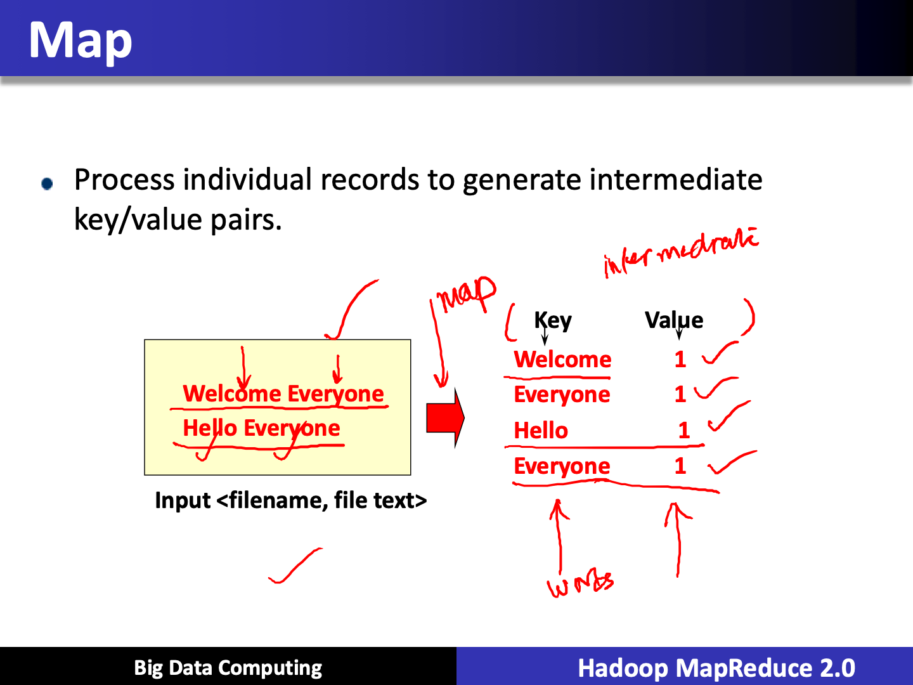
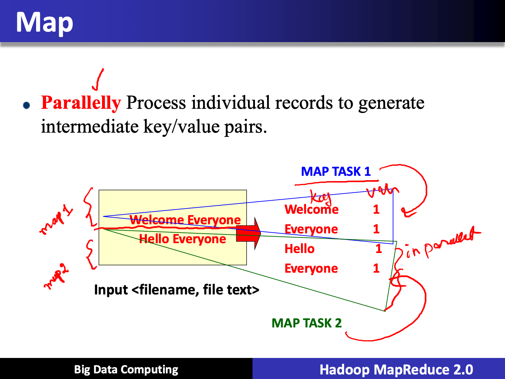
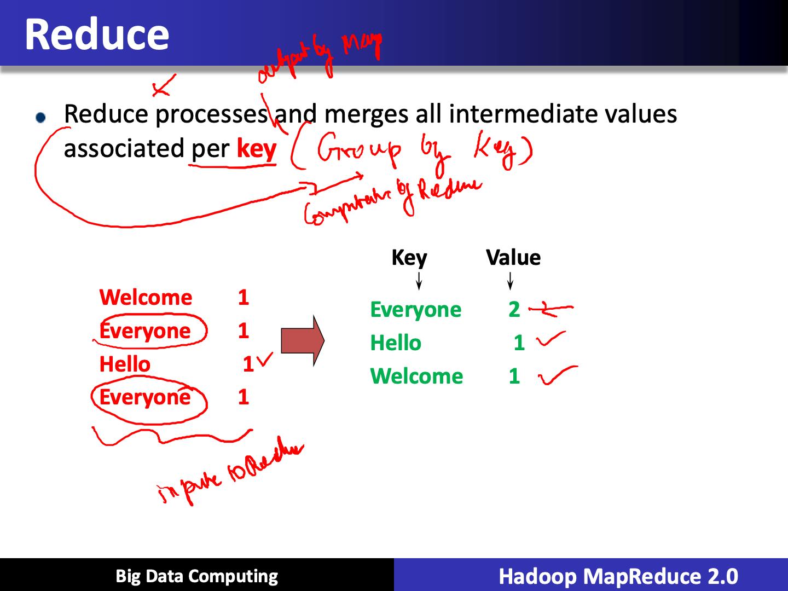
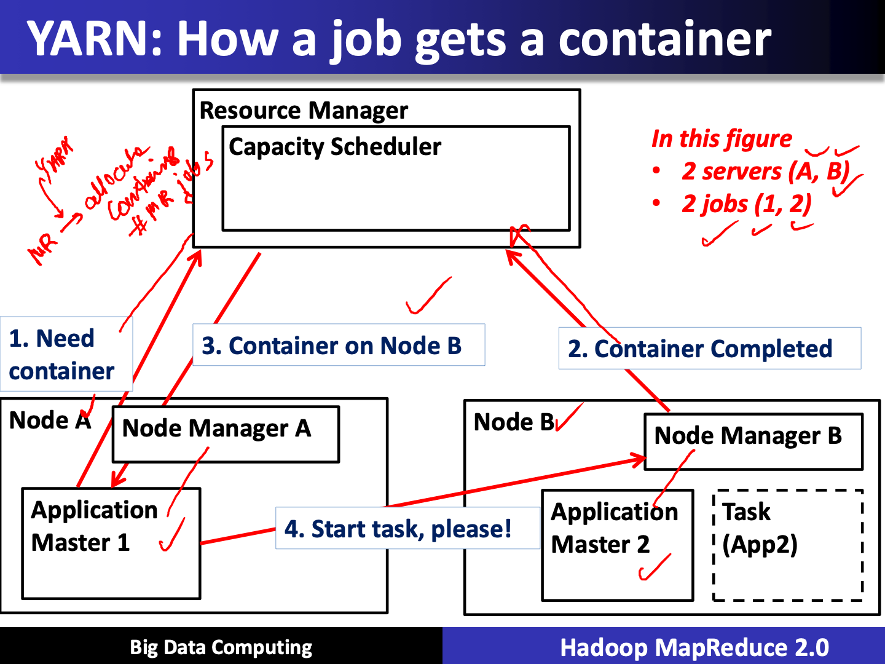

# Hadoop MapReduce 2.0

Created: 2019-03-08 22:18:27 +0500

Modified: 2020-08-15 23:39:23 +0500

---

## Introduction

- **MapReduce** is a programming model and an associated implementation for processing and generating large data sets
- Users specify a map function that processes a key/value pair to generate a set of intermediate key/value pairs, and a reduce function that merges all intermediate values associated with the same intermediate

## Projection Pushdown

Projection pushdown minimizes data transfer betweenMapR Databaseand the Apache Spark engine by omitting unnecessary fields from table scans. It is especially beneficial when a table contains many columns.
