# MapReduce Examples

Created: 2019-03-08 22:20:46 +0500

Modified: 2020-04-11 15:21:28 +0500

---

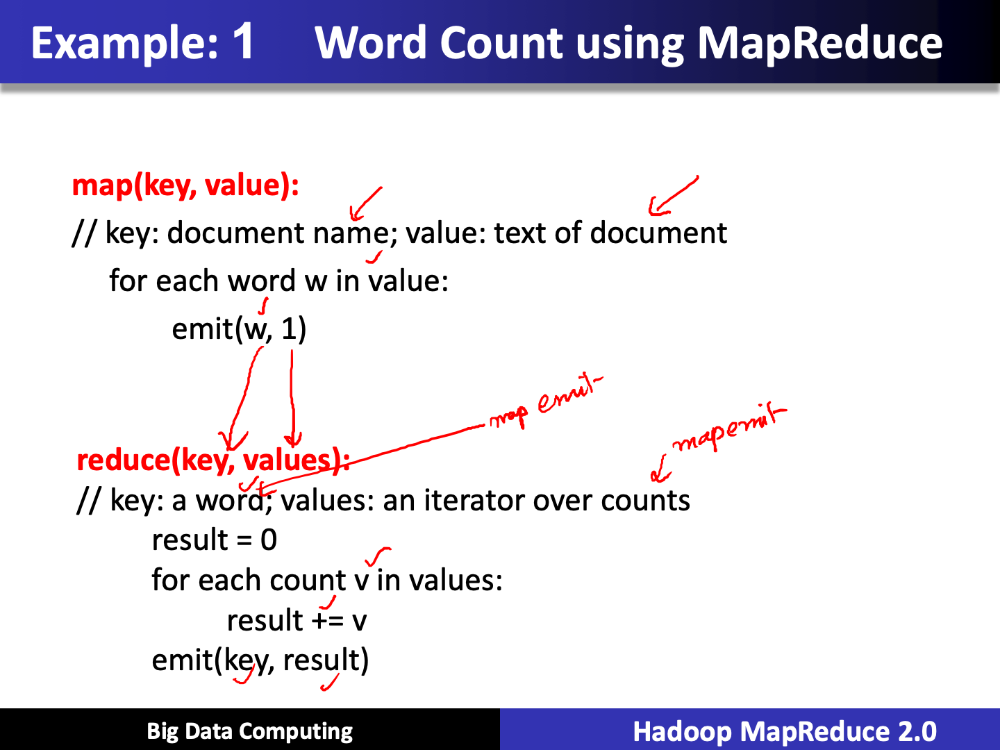

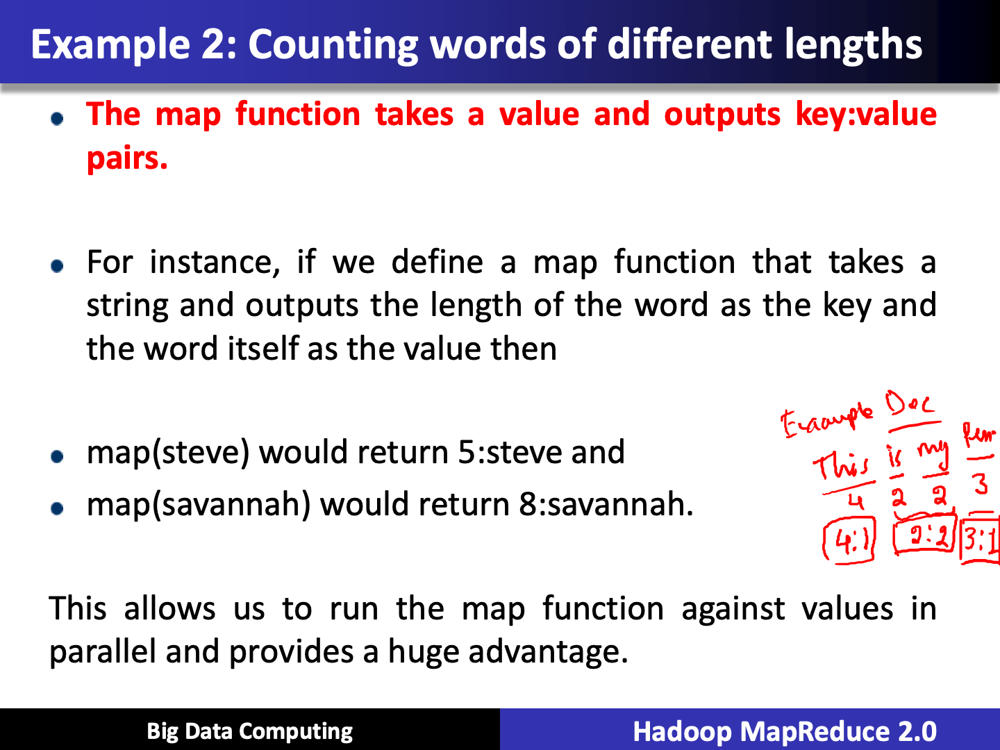

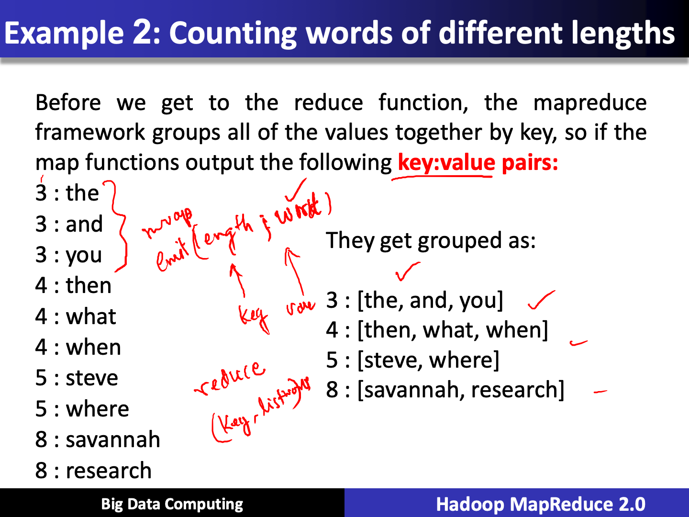

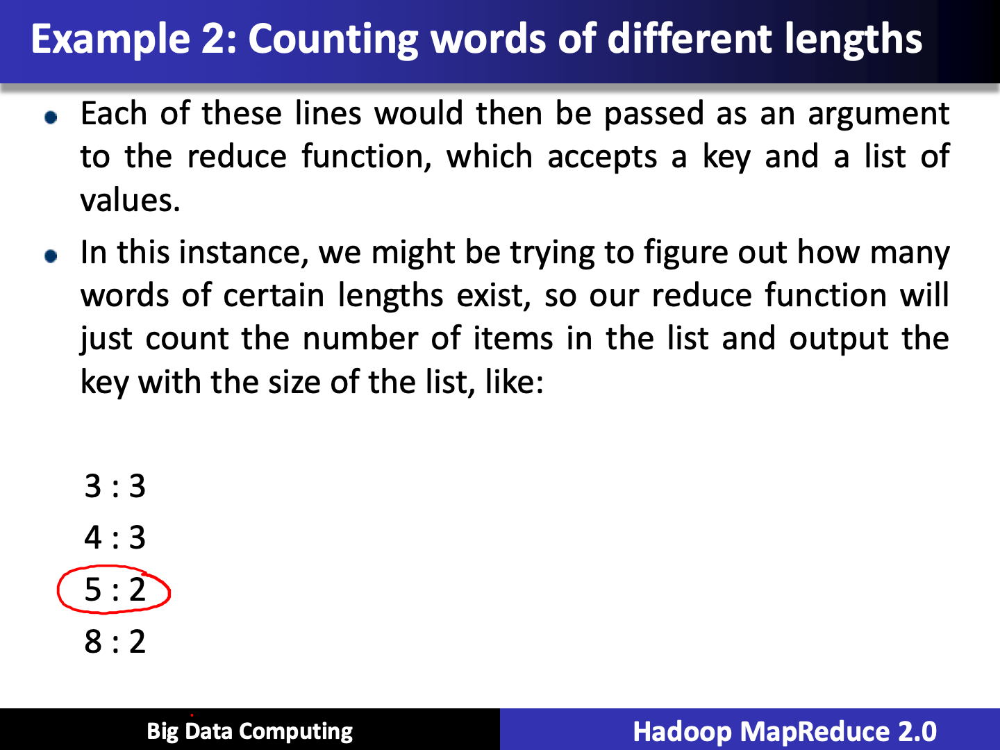

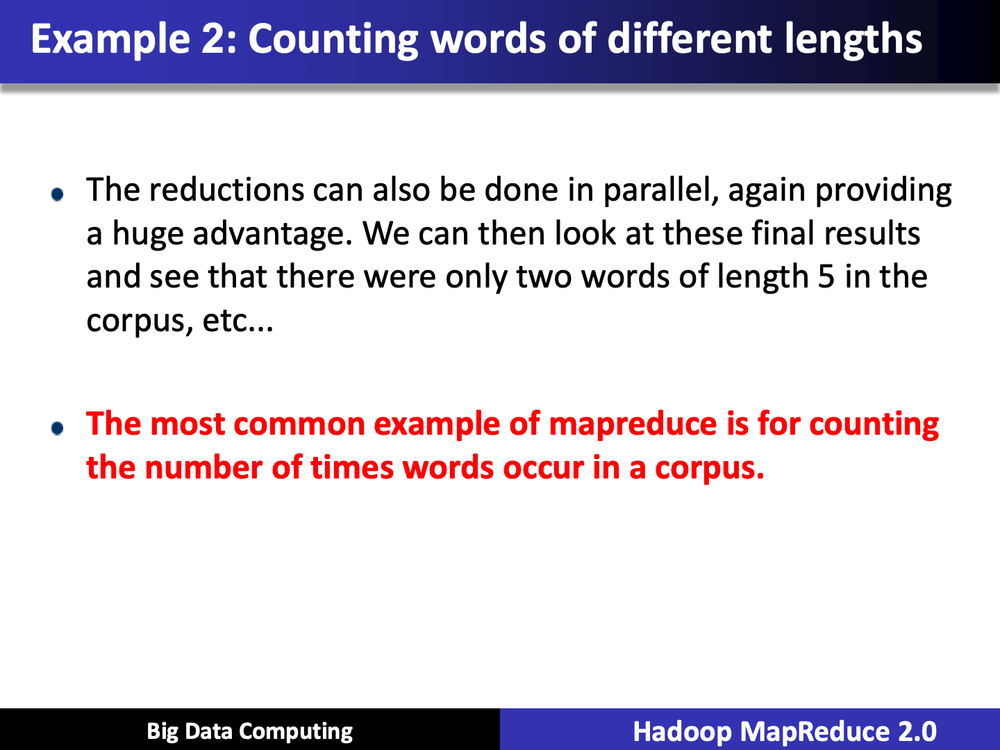

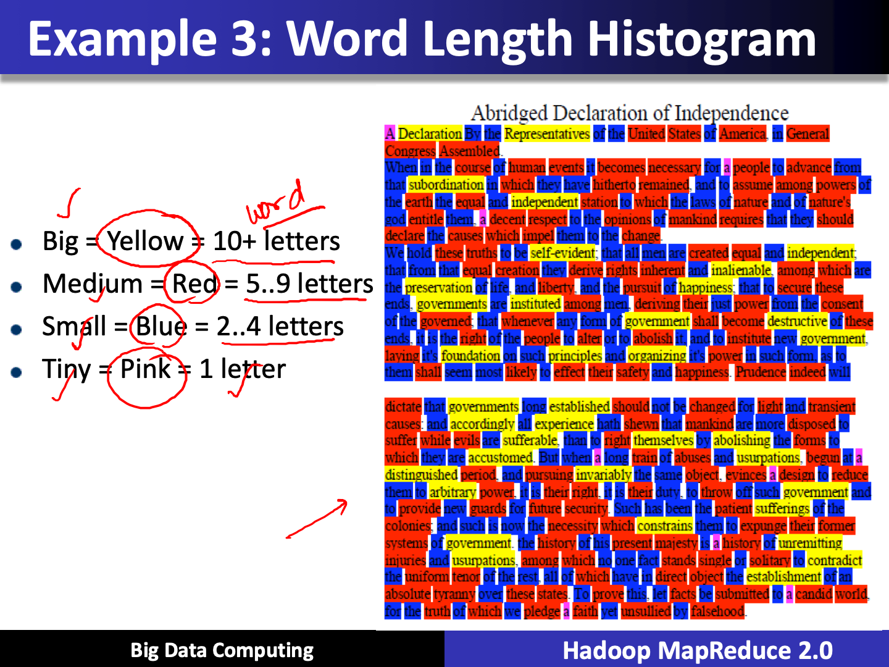

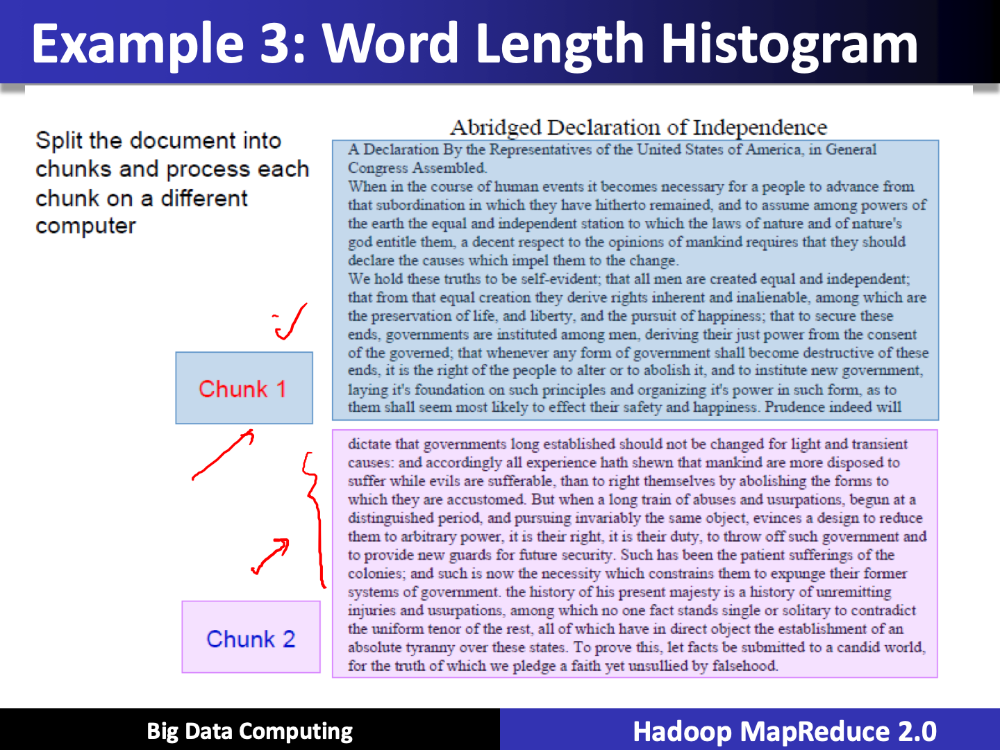

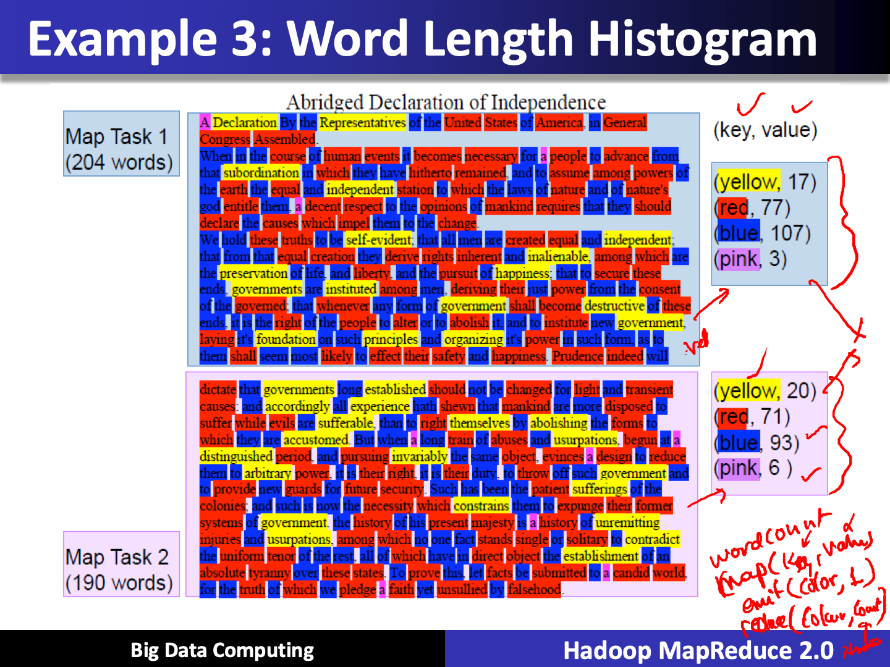

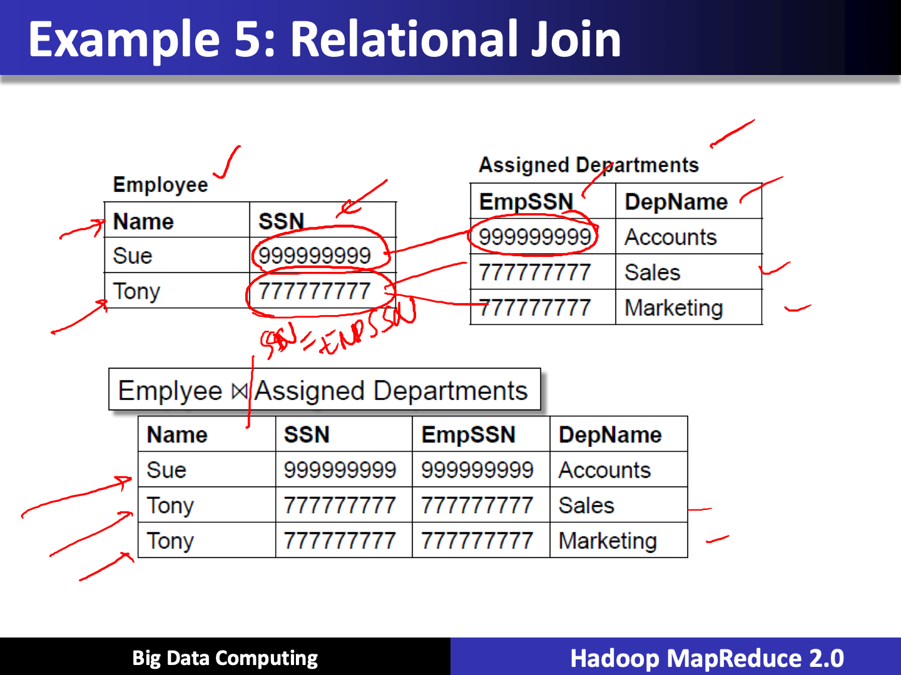

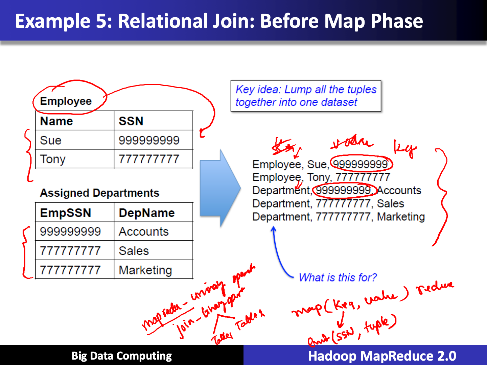

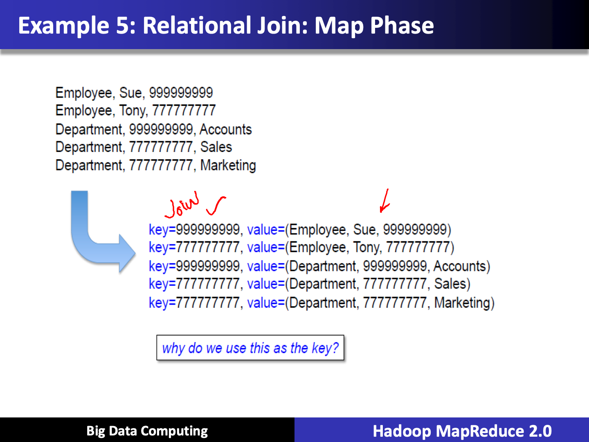

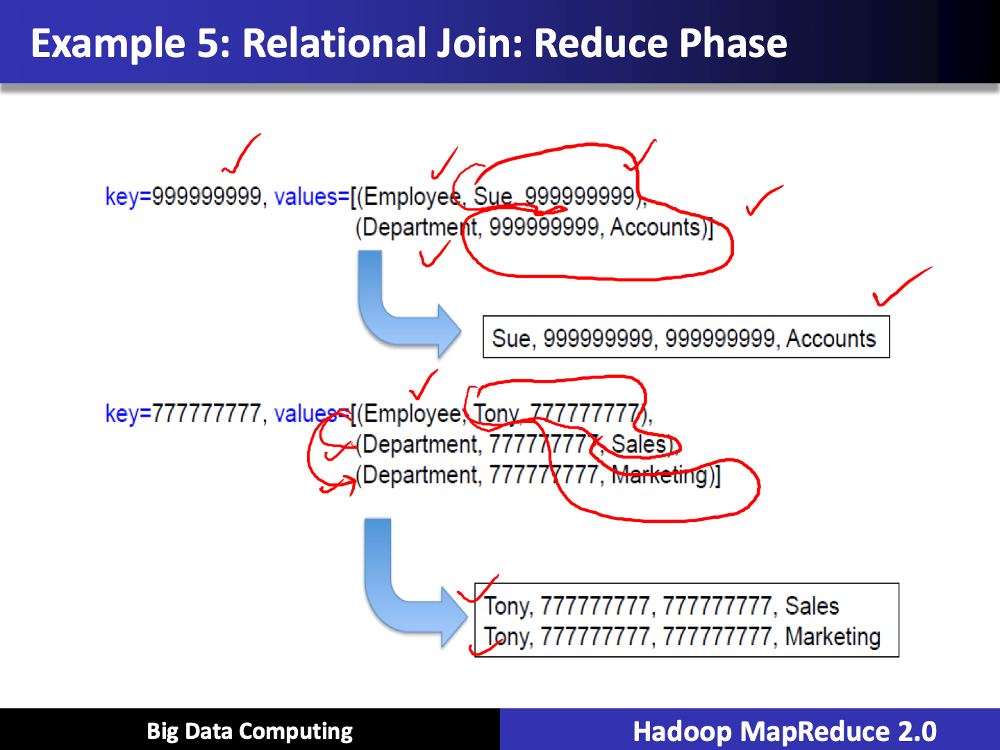

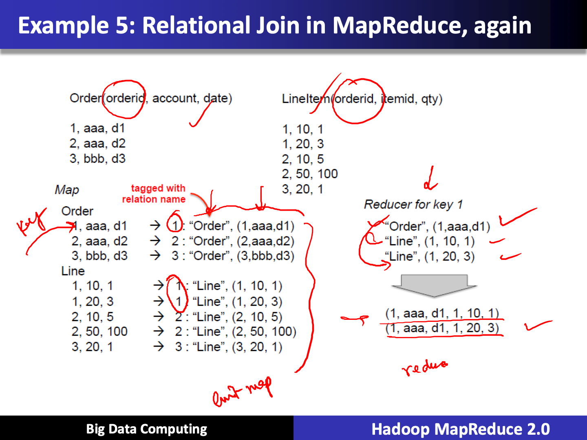

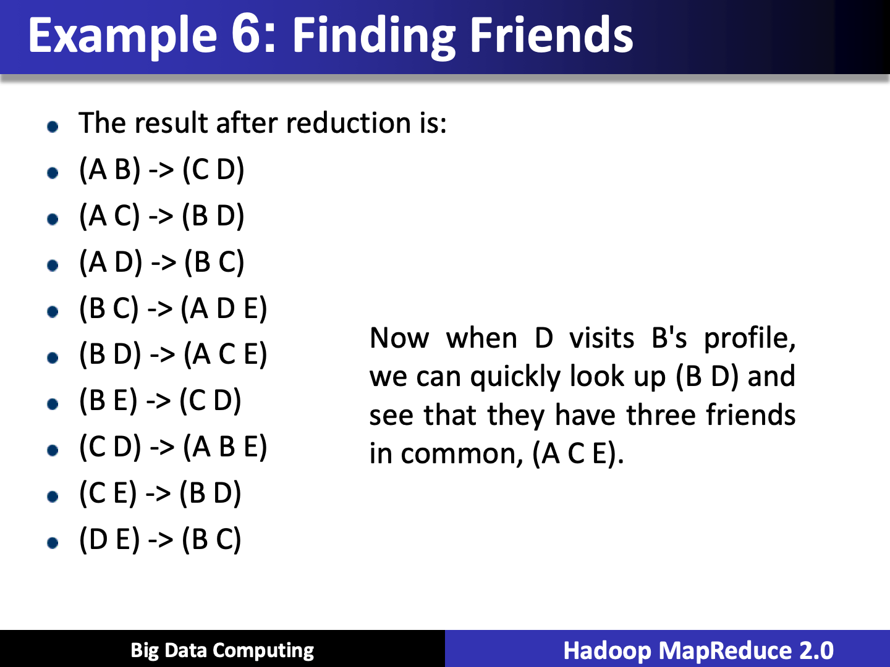

## MapReduce: Simplified Data Processing on Large Clusters

<https://ai.google/research/pubs/pub62>
