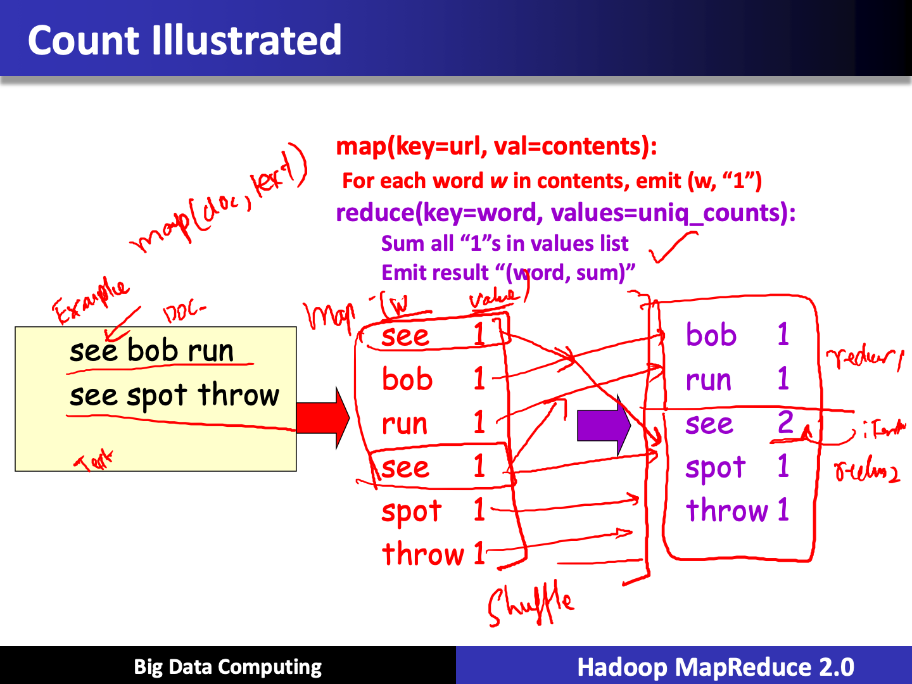
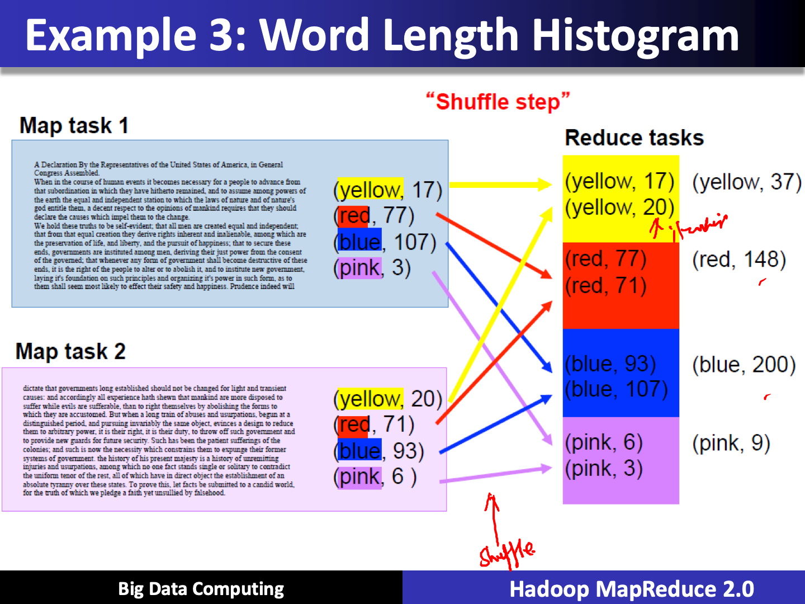
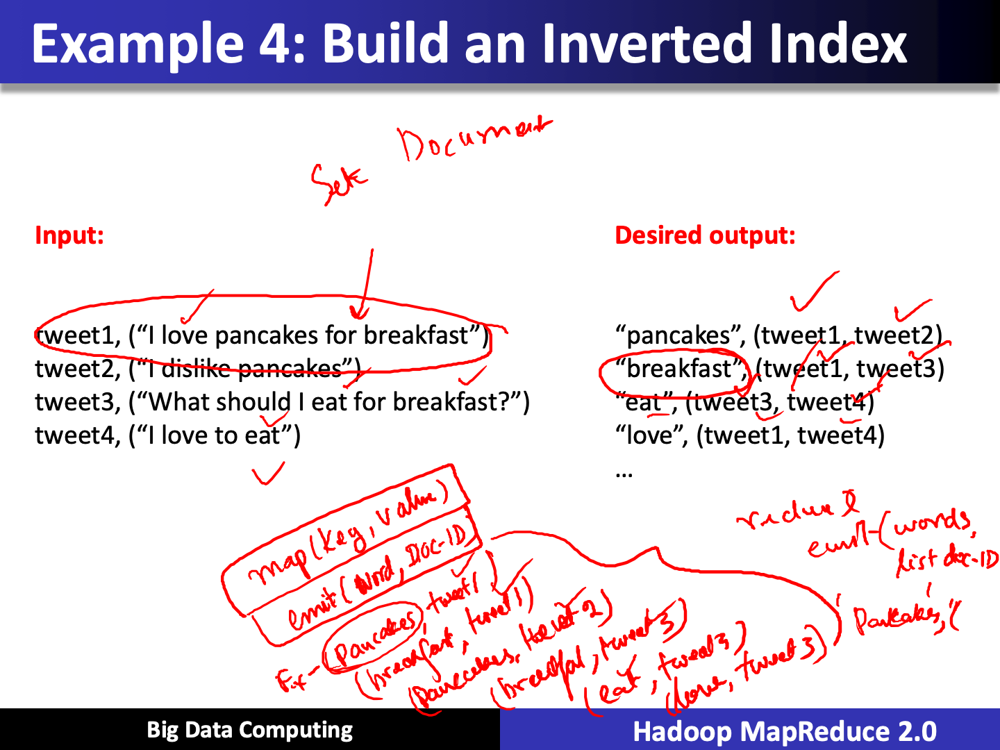
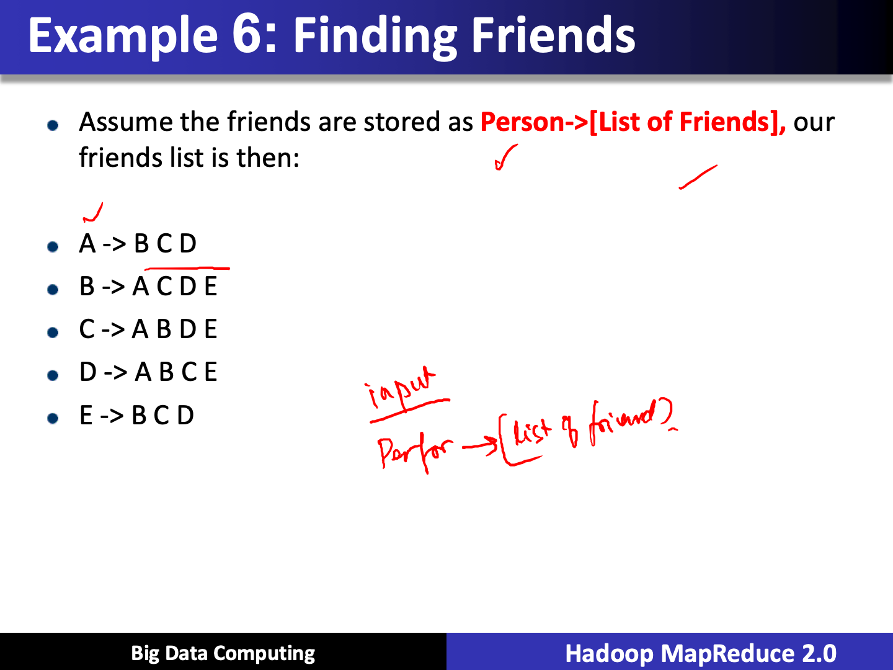
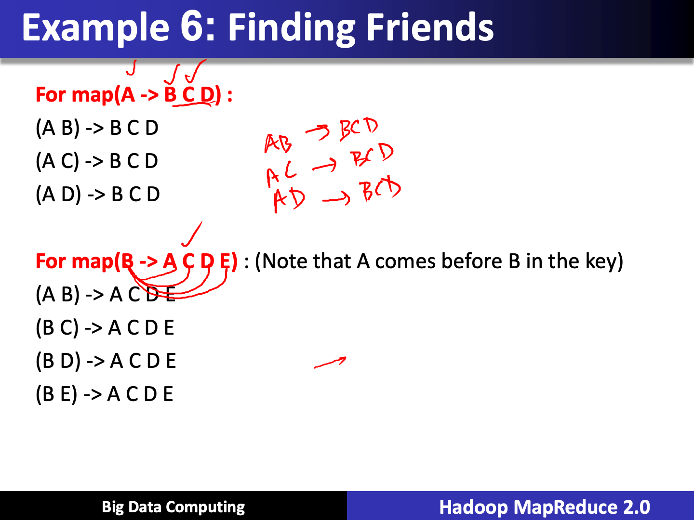
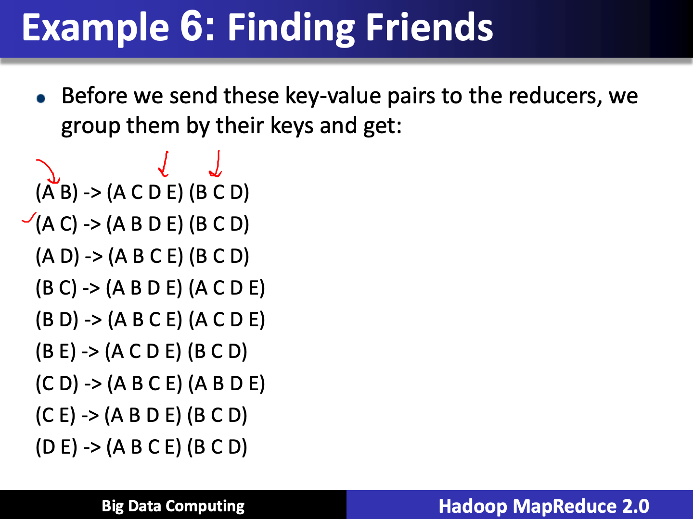

# MapReduce Examples

Created: 2019-03-08 22:20:46 +0500

Modified: 2020-04-11 15:21:28 +0500

---

![Example 2: Counting words of differ Before we get to the reduce function, the framework groups all of the values together by map functions output the following key:value p 3 : the 3 : and 3 : you 4 : then 4 : what 4 : when 5 : steve They get grouped 3 : [the, and, you] 4 : [then, what, wh 5 : [Steve, where] ](../../../media/Technologies-Apache-MapReduce-Examples-image4.png)

![Example 3: Word Length Hisl Abridged Declaration of Independence A Declaration By the Representatives of the United States of America, in General Congre course of human events it becomes necessary for a people to advance from that subord hitherto remained, and to assume among powers of the earth the equal and independer of nature and of nature's god entitle them, a decent respect to the opinions of mankinc declare the causes which impel them to the change. We hold these truths to be self created equal and independent; that from that equal creation they derive rights inhere which are the preservation of life, and liberty, and the pursuit of happiness; that to secur are instituted among men, deriving their just power from the consent of the governed; government shall become destructive of these ends, it is the right of the people to al institute new government, laying it's foundation on such principles and organizing it's them shall seem most likely to effect their safety and happiness. Prudence indeed will die established should not be changed for light and transient causes: and accordingly all e mankind are more disposed to suffer while evils are sufferable, than to right themselves which they are accustomed. But when a long train of abuses and usurpations, begun at pursuing invariably the same object, evinces a design to reduce them to arbitrary powe duty, to throw off such government and to provide new guards for future security. sufferings of the colonies; and such is now the necessity which constrains them to expur government. the history of his present majesty is a history of unremitting injuries and us! ](../../../media/Technologies-Apache-MapReduce-Examples-image7.png)

![Example 3: Word Length Hisl Split the document into chunks and process each chunk on a different computer Chunk 1 Abridged Declaration of Ind A Declaration By the Representatives of the United States of Congress Assembled When in the course of human events it becomes necessary for that subordination in which they have hitherto remained, and t the eatth the equal and independent station to which the laws c god entitle them, a decent respect to the opinions of manhnd declare the causes which impel them to the change. We hold these tmt1E to be self-evident; that all men are create. that from that equal creation they derive rights inhetent and the preset-cation of life, and libetty, and the putsuit of happtne ends, govemments are instituted among men, deriving their ju of the govemed; that whenever any fum of government shall ends, it is the right of the people to alter or to abolish it, and laying it's foundation on such principles and organizng it's po them shall seem most likely to effect their safety and happines dictate that governments long established should not be chang causes: and accordingly all experience hath shewn that suffer while evils are sufferable, than to right themselves by al which they are accustomed But when a long train of abuses a: distinguished period, and pursuing invanably the same object, them to aåitrary power, it is their right, it is their duty, to tlu•o to provide new for future security. Such has been the p ](../../../media/Technologies-Apache-MapReduce-Examples-image9.png)

## MapReduce: Simplified Data Processing on Large Clusters

<https://ai.google/research/pubs/pub62>
