# Data Pipeline Architecture

Created: 2018-11-18 17:22:25 +0500

Modified: 2020-02-12 13:20:28 +0500

---

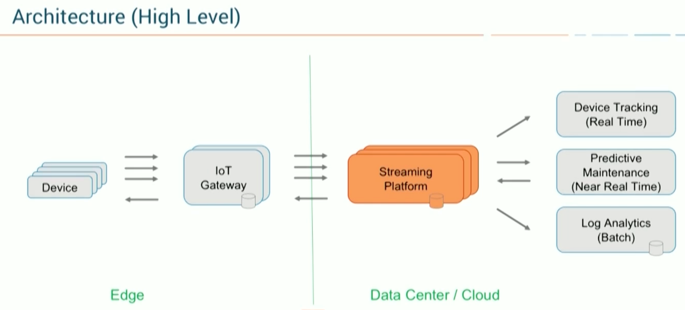

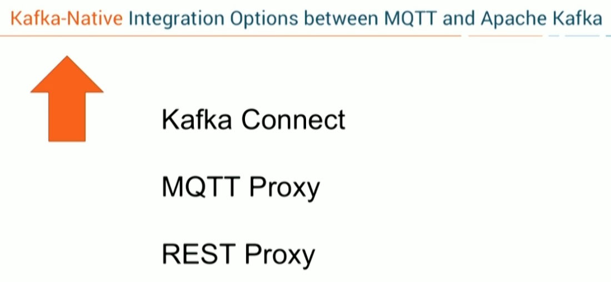

1. **Integration with Kafka Connect (Source and Sink), using MQTT Broker**

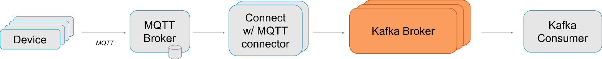

In this approach, you pull the data from the MQTT Broker via Kafka Connect to the Kafka Broker. You can leverage any features of Kafka Connect, such as built-in fault tolerance, load balancing, Converters, and Simple Message Transformations (SMT) for routing/filtering/etc., scaling different connectors in one Connect worker instance and other Kafka Connect related benefits.

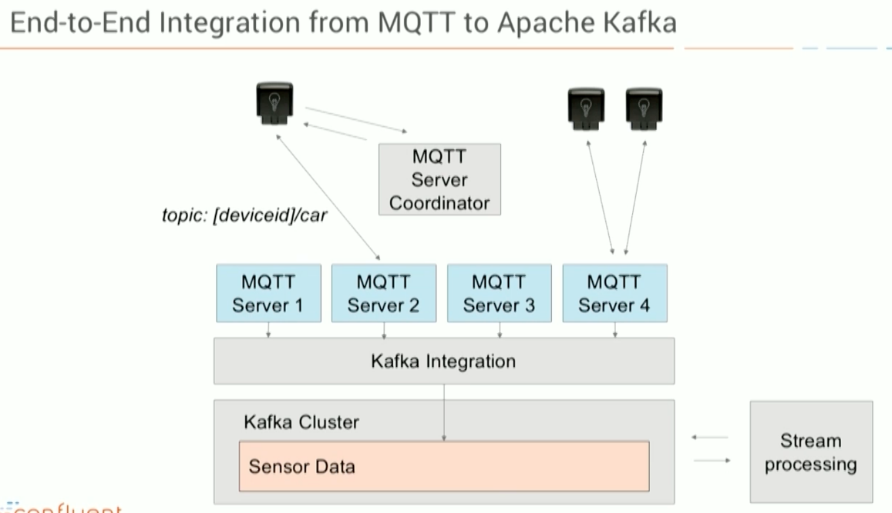

## MQTT Broker

- Persistent + offers MQTT-specific features
- Consumes push data from IoT devices

## Kafka Connect

- Kafka Consumer + Kafka Producer under the hood
- Pull-based (at own pace, without overwhelming the source or getting overwhelmed by the source)
- Out-of-the-box scalability and integration features (like connectors, converters, SMTs)

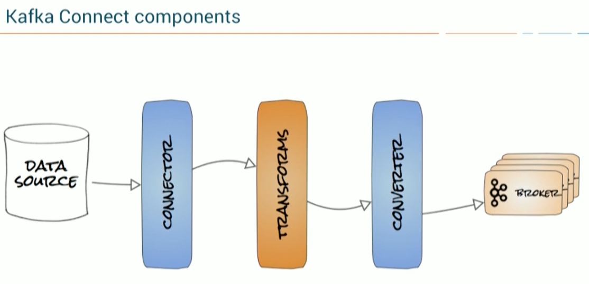

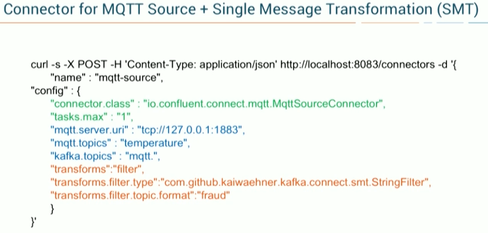

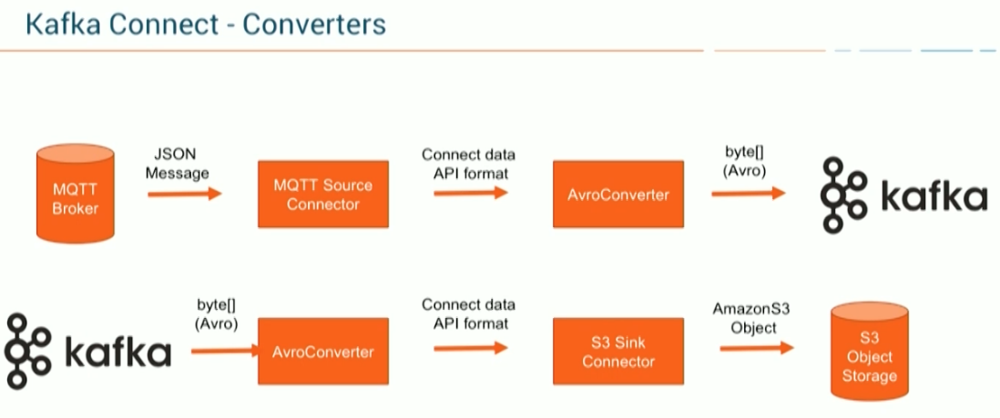

2. **Using confluent MQTT Proxy**

As an alternative to using Kafka Connect, you can leverage Confluent MQTT Proxy. You will need to integrate IoT data from IoT devices directly without the need for an MQTT Broker:

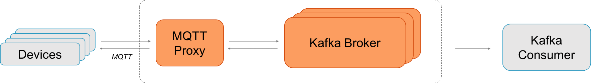

In this approach, you push the data directly to the Kafka broker via the Confluent MQTT Proxy. You can scale MQTT Proxy easily with a Load Balancer (similar to Confluent REST Proxy). The huge advantage is that you do not need an additional MQTT Broker in the middle. This reduces efforts and costs significantly. It is a better approach for pushing data into Kafka.

## MQTT Proxy

- MQTT is push-based
- Horizontally scalable
- Consumes push data from IoT devices and forwards it to Kafka Broker at low-latency
- Kafka Producer under the hood
- No MQTT Broker needed

## Kafka Broker

- Source of truth
- Responsible for persistence, high availability, reliability

## Details of Confluent's MQTT Proxy Implementation

## General and modular framework

- Based on Netty to not re-invent the wheel (network layer handling, thread pools)
- Scalable with standard load balancer
- Internally uses Kafka Connect formats (allows re-using transformation and other Connect-constructs)

## Three pipeline stages

- Network (Netty)
- Protocol (like MQTT with QoS 0,1,2 today, later others, maybe e.g. WebSockets)
- Stream (Kafka clients: Today Producers, later also consumers)

## Missing parts in first release

- *Only MQTT Publish; MQTT Subscribe coming soon*
- *MQTT-specific features like last will or testament*

3. **Confluent REST Proxy**

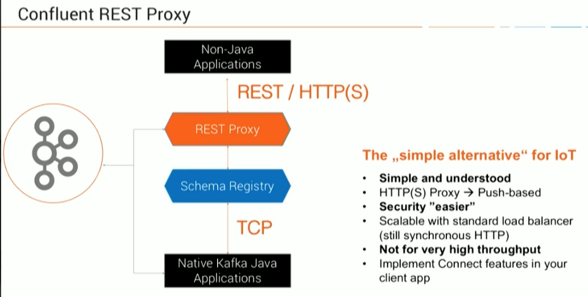

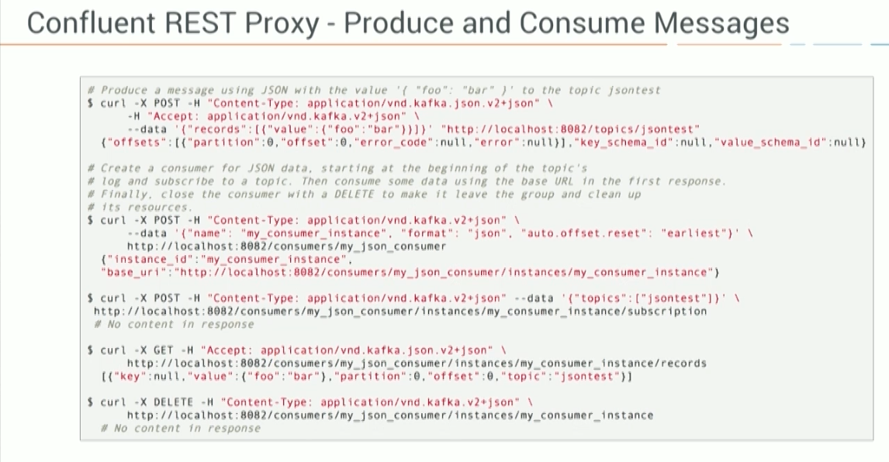

## Design Questions

1. How much throughput?

2. Ingest-only vs processing of data?

3. Analytical vs operational deployments?

4. Device publish only vs device pub/sub?

5. Pull vs Push?

6. Low-level client vs integration framework vs proxy?

7. Integration patterns needed? (transform, route, ...)?

8. IoT-specific features required (last will, testament, ...)?

## Building Data Pipelines

- Considerations when building data pipelines
  - Timeliness
  - Reliability
  - High and varying throughput
  - Data formats
  - Transformations
  - Security
  - Failure handling
  - Coupling and agility

# IoT Data Processing

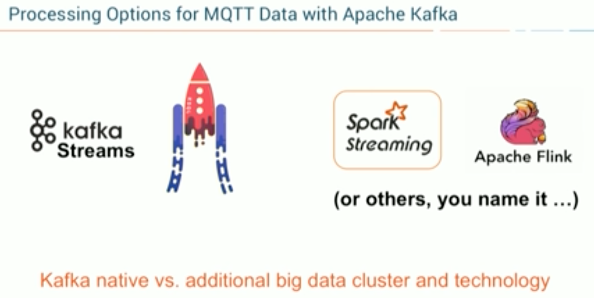

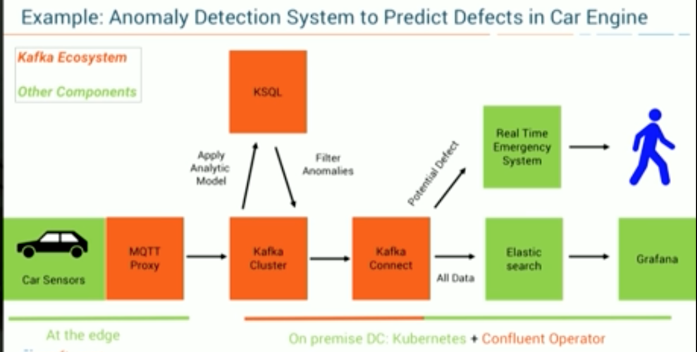

## Kafka Streaming Architecture

Kafka gets used most often for real-time streaming of data into other systems. Kafka is a middle layer to decouple your real-time data pipelines. Kafka core is not good for direct computations such as data aggregations, or CEP.***Kafka Streaming***which is part of the Kafka ecosystem does provide the ability to do real-time analytics. Kafka can be used to feed fast lane systems (real-time, and operational data systems) like Storm, Flink, Spark Streaming and your services and CEP systems. Kafka is also used to stream data for batch data analysis. Kafka feeds Hadoop. It streams data into your BigData platform or into RDBMS, Cassandra, Spark, or even S3 for some future data analysis. These data stores often support data analysis, reporting, data science crunching, compliance auditing, and backups.

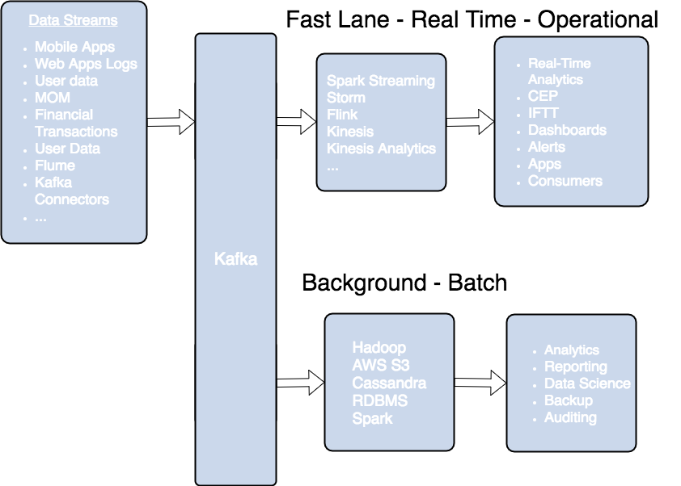

# Example Architecture

![Streaming with Apache Kafka and Apache NiFi Sources REST JDBC Twitter MQTT JMS Sensors Images PDF Word AWS servicei_ii Data API PostgreSQL books Subscribers REST Web Kafka JMS Slack Email Websockets : docker Python Browser Any Data, Any Time, Any Where, Any Workload Ingestion Filtering Messages Ranger Ambari I Message Bus I kafka Images Weather Stocks [Request] , SCHEMA REGISTRY Authentication Authorization APACHE NIH • registry Processing APACHE Spark Real-time Event Processing Data Access Hive Monitoring / Alerts HDFS Data Storage I Advanced Analytics I Ø Superset Deployed Operational Analytics A PAC HE Spork -9 druid Real-time Store Security & Governance Audit Administration Data Export Data Lineage (via NiFi) Atlas Data Encryption Platform Operations Operational Framework Cluster Management High Availability SmartSense Monitoring ](../../media/Technologies-Apache-Data-Pipeline-Architecture-image14.jpeg)

So to plan out what we are going to do, I have a high-level architecture diagram. We are going to ingest a number of sources including REST feeds, Social Feeds, Messages, Images, Documents, and Relational Data.

We will ingest with NiFi and then filter, process, and segment it into Kafka topics. Kafka data will be in Apache Avro format with schemas specified in the Hortonworks Schema Registry. Spark and NiFi will do additional event processing along with machine learning and deep learning. This will be stored in Druid for real-time analytics and summaries. Hive, HDFS, and S3 will store the data for permanent storage. We will do dashboards with Superset and Spark SQL + Zeppelin.

We will also push back cleaned and aggregated data to subscribers via Kafka and NiFi. We will push to Dockerized applications, message listeners, web clients, Slack channels, and email mailing lists.

To be useful in our enterprise, we will have full authorization, authentication, auditing, data encryption, and data lineage via Apache Ranger, Apache Atlas, and Apache NiFi. NiFi Registry and GitHub will be used for source code control.

We will have administration capabilities via Apache Ambari.

Real-time free stock data is available from IEX with no license key. The data streams in very fast, thankfully that's no issue for Apache NiFi and Kafka.

<https://api.iextrading.com/1.0/stock/market/batch?symbols=hdp&types=quote,news,chart&range=1y&last=25000>

<https://dzone.com/articles/real-time-stock-processing-with-apache-nifi-and-ap>

## example Streaming Architecture

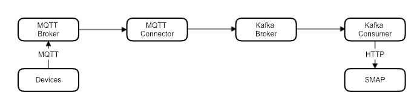

## Push vs Pull based architecture

In Kafka, consumerspulldata from brokers. In NATS Streaming, brokerspushdata to consumers. Kafka's[documentation](http://kafka.apache.org/documentation.html#design_pull)describes this design decision in detail. The key factor largely comes down to flow control. With push, flow control needs to be explicit to deal with diverse consumers. Different consumers will consume at different rates, so the broker needs to be aware of this so as not to overwhelm a consumer.

There are obvious advantages and disadvantages to both approaches. With push, it can be a tricky balance to ensure full utilization of the consumer. We might use a backoff protocol like[additive increase/multiplicative decrease](https://en.wikipedia.org/wiki/Additive_increase/multiplicative_decrease), widely known for its use in TCP congestion control, to optimize utilization.NATS Streaming, like many other messaging systems, implements flow control by using acks. Upon receiving a message, consumers ack back to the server, and the server tracks the in-flight messages for each consumer. If that number goes above a certain threshold, the server will stop delivery until more acks are received. There is a similar flow-control mechanism between the publisher and the server. The trade-off here is the server needs to do some bookkeeping, which we'll get to in a bit. With a pull-based system, flow control is implicit. Consumers simply go at their own pace, and the server doesn't need to track anything. There is much less complexity with this.

Pull-based systems lend themselves to aggressive batching. With push, we must decide whether to send a message immediately or wait to accumulate more messages before sending. This is a decision pertaining to latency versus throughput. Push is often viewed as an optimization for latency, but if we're tuning for low latency, we send messages one at a time only for them to end up being buffered on the consumer anyway. With pull, the consumer fetches all available messages after its current position in the log, which basically removes the guesswork around tuning batching and latency.

There are API implications with this decision too, particularly from an ergonomics and complexity perspective. Kafka clients tend to be "thick" and have a lot of complexity. That is, they do a lot because the broker is designed to be simple. That's my guess as to why there are so few native client libraries up to par with the Java client. NATS Streaming clients, on the other hand, are relatively "thin" because the server does more. We end up just pushing the complexity around based on our design decisions, but one can argue that the[smart client and dumb server](https://bravenewgeek.com/smart-endpoints-dumb-pipes/)is a more scalable approach. We'll go into detail on that in the next installment of this series.

Circling back on consumer scalability, the fact that NATS Streaming uses a push-based model means we can't simply setup read replicas and balance consumers among them. Instead, we would need to partition consumers among the replicas so that each server is responsible for pushing data to a subset of consumers. The increased complexity over pull becomes immediately apparent here.

<https://bravenewgeek.com/building-a-distributed-log-from-scratch-part-3-scaling-message-delivery>

## Reference

<https://dzone.com/articles/apache-kafka-mqtt-end-to-end-iot-integration-githu>

<https://www.confluent.io/kafka-summit-sf18/processing-iot-data-from-end-to-end>

<http://cloudurable.com/blog/what-is-kafka/index.html>

## Projects

- <https://github.com/kaiwaehner/ksql-udf-deep-learning-mqtt-iot>
- <https://github.com/kaiwaehner/kafka-connect-iot-mqtt-connector-example>
- <https://github.com/kaiwaehner/ksql-fork-with-deep-learning-functionp>
