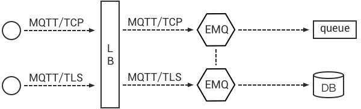

# Deployment and Installation

Created: 2018-12-09 23:20:40 +0500

Modified: 2018-12-10 12:00:18 +0500

---

Load Balancers
-   AWS Elastic Load Balancer (ELB)
-   HA proxy
-   Nginx

Following ports are opened for cluster internal communication:

| 4369 | Node discovery port |
|------|---------------------|
| 6369 | Cluster channel     |

**TCP Ports Used**

| 1883  | MQTT Port                |
|-------|--------------------------|
| 8883  | MQTT/SSL Port            |
| 8083  | MQTT/WebSocket Port      |
| 8084  | MQTT/WebSocket/SSL Port  |
| 8080  | HTTP Management API Port |
| 18083 | Web Dashboard Port       |

**Configuration Files**

The main configuration files of theEMQ Xbroker are under 'etc/' folder:

| **File**            | **Description**              |
|---------------------|------------------------------|
| etc/emqx.conf       | EMQ X3.0 Configuration File |
| etc/acl.conf        | The default ACL File         |
| etc/plugins/*.conf | Config Files of Plugins      |

**EMQ X Autodiscovery Strategy**

EMQ X3.0 supports node discovery and autocluster with various strategies:

| Strategy | Description                     |
|----------|---------------------------------|
| manual   | Create cluster manually         |
| static   | Autocluster by static node list |
| mcast    | Autocluster by UDP Multicast    |
| dns      | Autocluster by DNS A Record     |
| etcd     | Autocluster using etcd          |
| k8s      | Autocluster on Kubernetes       |

