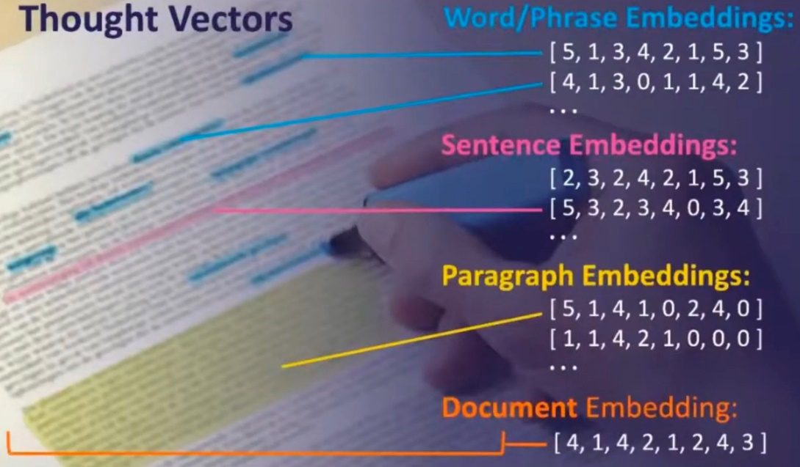

# Information Retrieval

Created: 2018-05-10 22:56:08 +0500

Modified: 2021-09-01 00:42:03 +0500

---

## Link Analysis and Web Search

Talks about "How Google Search indexes pages"

## tf-idf (term frequency - inverse document frequency)

In[information retrieval](https://en.wikipedia.org/wiki/Information_retrieval),tf--idforTFIDF, short forterm frequency--inverse document frequency, is a numerical statistic that is intended to reflect how important a word is to a[document](https://en.wikipedia.org/wiki/Document)in a collection or[corpus](https://en.wikipedia.org/wiki/Text_corpus).[[1]](https://en.wikipedia.org/wiki/Tf%E2%80%93idf#cite_note-1)It is often used as a[weighting factor](https://en.wikipedia.org/wiki/Weighting_factor)in searches of information retrieval,[text mining](https://en.wikipedia.org/wiki/Text_mining), and[user modeling](https://en.wikipedia.org/wiki/User_modeling). The tf--idf value increases[proportionally](https://en.wikipedia.org/wiki/Proportionality_(mathematics))to the number of times a word appears in the document and is offset by the number of documents in the corpus that contain the word, which helps to adjust for the fact that some words appear more frequently in general. Tf--idf is one of the most popular term-weighting schemes today; 83% of text-based recommender systems in digital libraries use tf--idf.

Variations of the tf--idf weighting scheme are often used by[search engines](https://en.wikipedia.org/wiki/Search_engine)as a central tool in scoring and ranking a document's[relevance](https://en.wikipedia.org/wiki/Relevance_(information_retrieval))given a user[query](https://en.wikipedia.org/wiki/Information_retrieval). tf--idf can be successfully used for[stop-words](https://en.wikipedia.org/wiki/Stop-words)filtering in various subject fields, including[text summarization](https://en.wikipedia.org/wiki/Automatic_summarization)and classification.

One of the simplest[ranking functions](https://en.wikipedia.org/wiki/Ranking_function)is computed by summing the tf--idf for each query term; many more sophisticated ranking functions are variants of this simple model.

## Term frequency

Suppose we have a set of English text documents and wish to rank which document is most relevant to the query, "the brown cow". A simple way to start out is by eliminating documents that do not contain all three words "the", "brown", and "cow", but this still leaves many documents. To further distinguish them, we might count the number of times each term occurs in each document; the number of times a term occurs in a document is called itsterm frequency. However, in the case where the length of documents varies greatly, adjustments are often made (see definition below). The first form of term weighting is due to[Hans Peter Luhn](https://en.wikipedia.org/wiki/Hans_Peter_Luhn)(1957) which may be summarized as:
-   The weight of a term that occurs in a document is simply proportional to the term frequency.

## Inverse document frequency

Because the term "the" is so common, term frequency will tend to incorrectly emphasize documents which happen to use the word "the" more frequently, without giving enough weight to the more meaningful terms "brown" and "cow". The term "the" is not a good keyword to distinguish relevant and non-relevant documents and terms, unlike the less-common words "brown" and "cow". Hence aninverse document frequencyfactor is incorporated which diminishes the weight of terms that occur very frequently in the document set and increases the weight of terms that occur rarely.

[Karen Spärck Jones](https://en.wikipedia.org/wiki/Karen_Sp%C3%A4rck_Jones)(1972) conceived a statistical interpretation of term specificity called Inverse Document Frequency (idf), which became a cornerstone of term weighting:
-   The specificity of a term can be quantified as an inverse function of the number of documents in which it occurs.

Just the idea that you can enter in a query and then you could turn that query into a vector and then you have all of your documents also modeled as vectors and then you have a mathematical relationship that you can define between your search query and each of those documents. You can model them in space and then find how the query differs from all of those documents in space and then you have a ranking.

## References

<https://en.wikipedia.org/wiki/Tf%E2%80%93idf>

## Okapi BM25

In[information retrieval](https://en.wikipedia.org/wiki/Information_retrieval),Okapi BM25(BM stands for Best Matching) is a[ranking function](https://en.wikipedia.org/wiki/Ranking_function)used by [search engines](https://en.wikipedia.org/wiki/Search_engine) to rank matching documents according to their[relevance](https://en.wikipedia.org/wiki/Relevance_(information_retrieval))to a given search query. It is based on the[probabilistic retrieval framework](https://en.wikipedia.org/wiki/Probabilistic_relevance_model)developed in the 1970s and 1980s by[Stephen E. Robertson](https://en.wikipedia.org/wiki/Stephen_E._Robertson),[Karen Spärck Jones](https://en.wikipedia.org/wiki/Karen_Sp%C3%A4rck_Jones), and others.

The name of the actual ranking function is BM25. To set the right context, however, it is usually referred to as "Okapi BM25", since the Okapi information retrieval system, implemented at [London](https://en.wikipedia.org/wiki/London)'s [City University](https://en.wikipedia.org/wiki/City_University,_London)in the 1980s and 1990s, was the first system to implement this function.

BM25 and its newer variants, e.g. BM25F (a version of BM25 that can take document structure and anchor text into account), represent state-of-the-art[TF-IDF](https://en.wikipedia.org/wiki/TF-IDF)-like retrieval functions used in document retrieval.

## Knowledge graph, Keyword Search
-   Inverted Index -> Term / Document
-   Embeddings
    -   Word / Phrase embeddings
    -   Sentence embeddings
    -   Paragraph embeddings
    -   Document embeddings

-   One hot encoding

-   Dimensionality reduction
-   Vector similarity scoring

Solr

1.  Streaming expressions

2.  Vectors fields/functions in solr

![Performance Considerations for Real-time Search Problem: Vector Scoring is Slow • Unlike keyword search, which looks up pre-indexed answers to queries, Vector Search must instead calculate similarities between the query vector and every document's vectors to determine best matches, which is slow at scale. Solution: Quantized Vectors / Approximate Nearest Neighbors • "Quantization" is the process for mapping vector features to discrete values. • Creating "tokens" which map to a similar vector space, enables matching on those tokens to perform an ANN (Approximate Nearest Neighbor) search This enables converting vector scoring into a search problem (term lookup and scoring), which is fast again, at the expense of some recall and scoring accuracy Recommended Approach: ANN Search + Vector Similarity Reranking Combine the best of both worlds by running an initial ANN search on a quantized vector representation, and then re-rank the top-N results using full Vector similarity scoring. ](../../media/Technologies-Elasticsearch-Information-Retrieval-image7.jpeg)

![Keyword Search vs. Vector Search Likely Outcome Query Type Obscure keyword combinations Q. (software OR hardware) AND enginee* Specific identifiers and attributes Q. PROD12345 Q color:red Natural Language Queries Q. Can my spouse drive on my insurance? Fuzzy Language Queries Q. famous french tower Structured Relationship Queries Q. popular near haystack Keyword search succeeds Vector Search fails Keyword search succeeds, filtering down Vector Search likely fails, depending on how trained and whether overfitting Keyword sear, may get lucky, but probably fails Vector Search succeeds mismatch yields poor results Vector Search succeeds h fails Keyword Vector search fails Need a Knowledge Graph! ](../../media/Technologies-Elasticsearch-Information-Retrieval-image8.jpeg)

![Thoughts on Semantic Vector Spaces Thought Vectors (Embeddings), Knowledge Graphs, and Keyword Search ultimately resolve to the same overlapping (semantic) vector spaces. They are really just different ways of looking at the same relationships that exist within our content. • Likewise, it is also possible to model user behavior (signals) into either numerical vectors, tokens on documents, nodes and edges in a graph. or as • Certain types of attributes are much easier to represent as numerical --- such as image features. This makes multi-modal leaming (joint- vectors learning) much easier to accomplish than in the past with just keywords and knowledge graphs. ](../../media/Technologies-Elasticsearch-Information-Retrieval-image9.jpeg)

![Takeaways Thought Vectors (Embeddings) Work very well for natural language queries and questions, or for modeling non-textual data like image features and user signals. Dense vectors also make it much easier to enable joint learning --- modeling text content, user behavioral signals, images, and so on to a shared vector space. Only used for ---10% of Google Queries. Knowledge Graphs work best for relational queries, including reasoning about known entities, dealing with hierarchies, and multi-level inference Keyword search is NOT dead! It works best for long-tail keywords, specific item or attribute search (nameTld), obscure keywords, Boolean-type query needs, and is the safest catch-all for most queries. Finally, it should be possible to enable "explainable Al" on trained dense vector representations by mapping similar documents back to overlapping (semantic) vector spaces at the keyword and attribute level (such as through semantic knowledge graphs). The best systems will likely use a combination of all approaches blended together. ](../../media/Technologies-Elasticsearch-Information-Retrieval-image11.jpeg)

[Thought Vectors, Knowledge Graphs, and Curious Death(?) of Keyword Search](https://www.youtube.com/watch?v=JrORpCkuK3g)

## Neural Search

The core idea of neural search is to leverage state-of-the-art deep neural networks to buildeverycomponent of a search system. In short,neural search is deep neural network-powered information retrieval.In academia, it's often calledneural IR.

## What can it do?

Thanks to recent advances in deep neural networks, a neural search system can go way beyond simple text search. It enables advanced intelligence on all kinds of unstructured data, such as images, audio, video, PDF, 3D mesh, you name it.

For example, retrieving animation according to some beats; finding the best-fit memes according to some jokes; scanning a table with your iPhone's LiDAR camera and finding similar furniture at IKEA. Neural search systems enable what traditional search can't: multi/cross-modal data retrieval.

## Think outside the (search)box

Many neural search-powered applications do not have a search box:
-   A question-answering chatbot can be powered by neural search: by first indexing all hard-coded QA pairs and then semantically mapping user dialog to those pairs.
-   A smart speaker can be powered by neural search: by applying STT (speech-to-text) and semantically mapping text to internal commands.
-   A recommendation system can be powered by neural search: by embedding user-item information into vectors and finding top-K nearest neighbours of a user/item.

Neural search creates a new way to comprehend the world. It is creating new doors that lead to new businesses.

<https://github.com/jina-ai/jina/blob/master/.github/2.0/neural-search.md>

