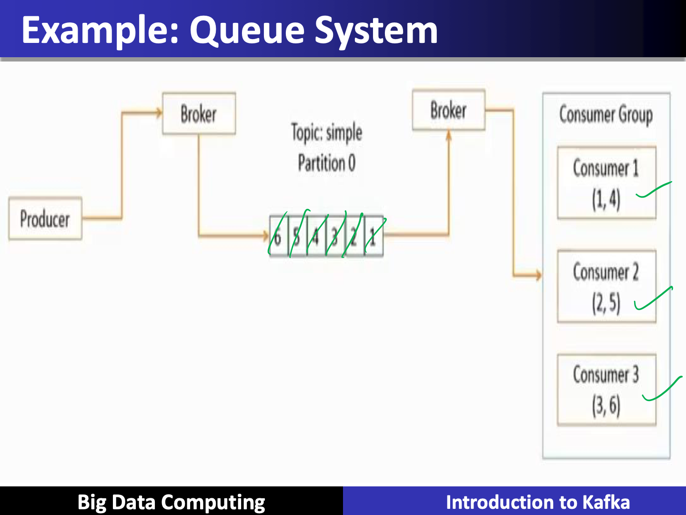
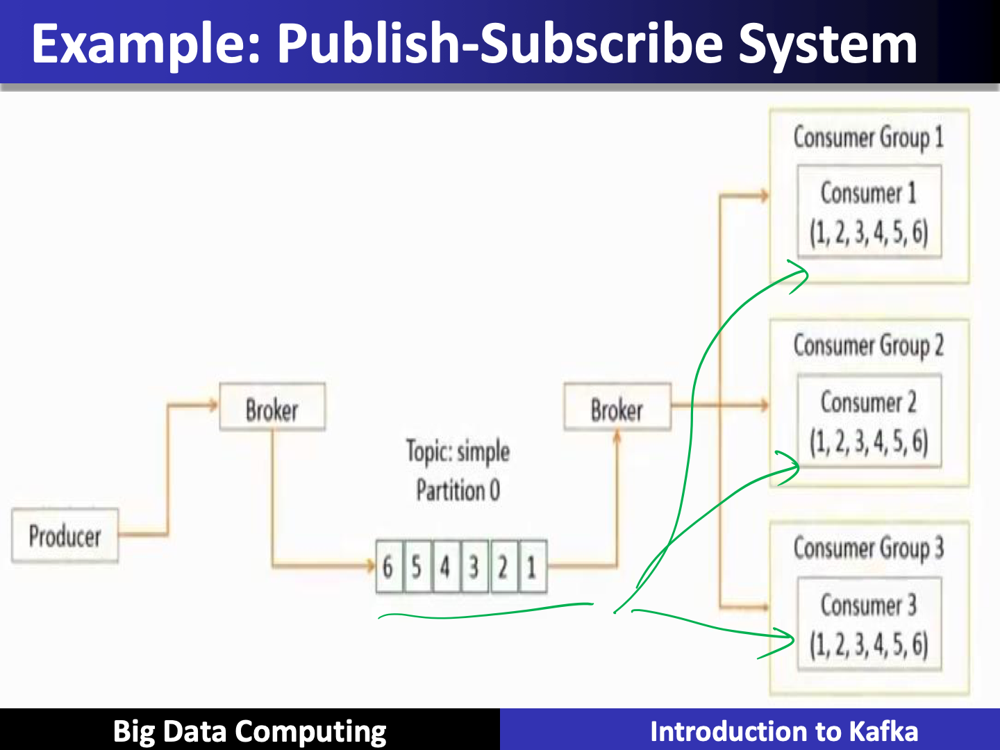

# Intro to Kafka

Created: 2019-03-24 14:03:55 +0500

Modified: 2020-05-05 21:28:03 +0500

---

## Kafka: a streaming data platform, Unix Pipelines Analogy
-   Kafka Core is the distributed, durable equivalent of Unix pipes. Use it to connect and compose your large-scale data applications
-   Kafka Streams are the commands of your Unix pipelines. Use it to transform data stored in Kafka
-   Kafka Connect is the I/O redirection in your Unix pipelines. Use it to get your data into an out of Kafka.

## Characteristics
-   It is a distributed and partitioned messaging system
-   It is highly fault-tolerant
-   It is highly scalable
-   It can process and send millions of messages per second to several receivers

## History
-   Originally developed by LinkedIn and later, handed over to the open source community in early 2011
-   It became a main Apache project in October, 2012
-   A stable Apache Kafka version 0.8.2.0 was release in Feb, 2015.

## Kafka Data Model

The Kafka data model consists of messages and topics
-   Messages represent information such as, lines in a log file, a row of stock market data, or an error message from a system
-   Messages are grouped into categories called topics. Example: LogMessage and Stock Message
-   The processes that publish messages into a topic in Kafka are known as producers.
-   The processes that receive the messages from a topic in Kafka are known as consumers.
-   The processes or servers within Kafka that process the messages are known as brokers.
-   A Kafka cluster consists of a set of brokers that process the messages

## Topics
-   A topic is a category of messages in Kafka
-   The producers publish the messages into topics
-   The consumers read the messages from topics
-   A topic is divided into one or more partitions
-   A partition is also known as a commit log
-   Each partition contains an ordered set of messages
-   Each message is identified by its offset in the partition
-   Messages are added at one end of the partition and consumed at the other

## Partitions
-   Topics are divided into partitions, which are the unit of parallelism in Kafka
    -   Partitions allow messages in a topic to be distributed to multiple servers
    -   A topic can have any number of partitions
    -   Each partition should fit in a single Kafka server
    -   The number of partitions decide the parallelism of the topic

## Partiton distribution
-   Partitions can be distributed across the Kafka cluster
-   Each Kafka server may handle one or more partitions
-   A partition can be replicated across serveral servers for fault-tolerance
-   One server is marked as a leader for the partition and the others are marked as followers
-   The leader controls the read and write for the partition, whereas the followers replicate the data
-   If a leader fails, one of the followers automatically become the leader.
-   Zookeeper is used for the leader selection

## Producers

The producer is the creator of the message in Kafka
-   The producers place the message to a particular topic
-   The producers also decide which partition to place the message into
-   Topics should already exist before a message is placed by the producer
-   Messages are added at one end of the partition

## Consumers

The consumer is the receiver of the message in Kafka
-   Each consumer belongs to a consumer group
-   A consumer group may have one or more consumers
-   The consumers specify what topics they want to listen to
-   A message is sent to all the consumers in a consumer group
-   The consumer groups are used to control the messaging system

## Kafka Architecture

Kafka consists of brokers that take messages from the producers and add to a partition of a topic. Brokers provide the messages to the consumers from the partitions.
-   A topic is divided into multiple partitions
-   The messages are added to the partitions at one end and consumed in the same order
-   Each partition acts as a message queue
-   Consumers are divided into consumer groups

## Types of messaging systems
-   Kafka architecture supports the publish-subscribe and queue system
-   Publish-subscribe system
    -   Each message is received by all the subscribers
    -   Each subscriber receives all the messages
    -   Messages are received in the same order that they are produced
-   Queue system
    -   Each message has to be consumed by only one consumer
    -   Each message is consumed by any one of the available consumers
    -   Messages are consumed in the same order that they are received

## Brokers

Brokers are the Kafka processes that process the messages in Kafka
-   Each machine in the cluster can run one broker
-   They coordinate among each other using Zookeeper
-   One broker acts as a leader for a partition and handles the delivery and persistence, where as, the others act as followers

## Kafka Guarantees
-   Messages sent by a producer to a topic and a partition are appended in the same order
-   A consumer instance gets the messages in the same order as they are produced
-   A topic with replication factor N, tolerates upto N-1 server failures

## Replication in Kafka

Kafka uses the primary-backup method of replication
-   One machine (one replica) is called a leader and is chosen as the primary; the remaining machines (replicas) are chosen as the followers and act as backups
-   The leader propagates the writes to the followers
-   The leader waits until the writes are completed on all the replicas
-   If a replica is down, it is skipped for the write until it comes back
-   If the leader fails, one of the followers will be chosen as the new leader; this mechanism can tolerate n-1 failures if the replication factor is n

## Persistence in Kafka

Kafka uses the Linux file system for persistence of messages
-   Persistence ensures no messages are lost
-   Kafka relies on the file system page cache for fast reads and writes
-   All the data is immediately written to a file in file system
-   Messages are grouped as message sets for more efficient writes
-   Message sets can be compressed to reduce network bandwidth
-   A standarized binary message format is used among producers, brokers, and consumers to minimize data modification

## 3 major components:

1.  **Kafka Core:** A central hub to transport and store event streams in real-time

2.  **Kafka Connect:** A framework to import event streams from other soure data systems into Kafka and export event streams from Kafka to destination data systems

3.  **Kafka Streams:** A Java library to process event streams live as they occur

## Conclusion
-   Kafka is a high-performance, real-time messaging system
-   Kafka can be used as an external commit log for distributed systems
-   Kafka data model consists of messages and topics
-   Kafka architecture consists of brokers that take messages from the producers and add to a partition of a topics
-   Kafka architecture supports two types of messaging system called publish-subscribe and queue system
-   Brokers are the Kafka processes that process the messages in Kafka
