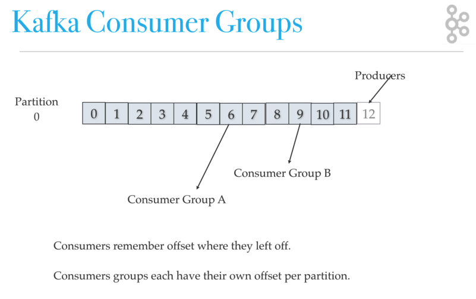
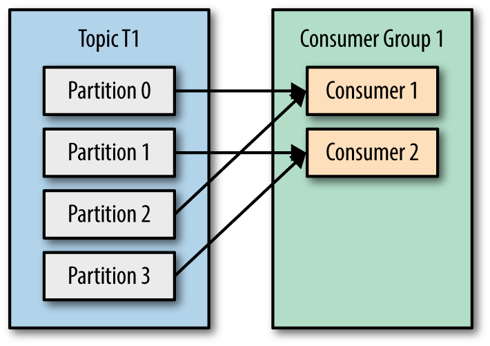
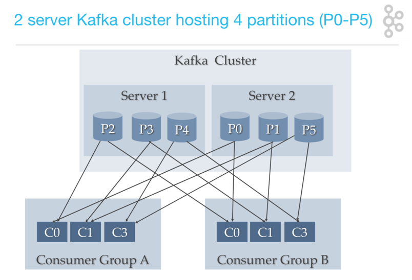

# Kafka Consumers

---

# Kafka Consumers: Reading Data from Kafka (Definitive Guide)

- Consumer and Consumer Groups
- *Rebalance*
  - Moving partition ownership from one consumer to another
  - During a rebalance, consumers can't consume messages, so a rebalance is basically a short window of unavailability of the entire consumer group
  - when partitions are moved from one consumer to another, the consumer loses its current state; if it was caching any data, it will need to refresh its caches - slowing down the application until the con‐ sumer sets up its state again.
- *Heatbeats*
  - The way consumers maintain membership in a consumer group and ownership of the partitions assigned to them is by sending *heartbeats* to a Kafka broker designated as the *group coordinator* (this broker can be different for different consumer groups).
  - As long as the consumer is sending heartbeats at regular intervals, it is assumed to be alive, well, and processing messages from its partitions.
  - Heartbeats are sent when the consumer polls (i.e., retrieves records) and when it commits records it has consumed.
  - If the consumer stops sending heartbeats for long enough, its session will time out and the group coordinator will consider it dead and trigger a rebalance. If a consumer crashed and stopped processing messages, it will take the group coordinator a few seconds without heartbeats to decide it is dead and trigger the rebalance. During those seconds, no messages will be processed from the partitions owned by the dead consumer. When closing a consumer cleanly, the consumer will notify the group coordinator that it is leaving, and the group coordinator will trigger a rebalance immediately, reducing the gap in processing.
- How Does the Process of Assigning Partitions to Brokers Work?
  - When a consumer wants to join a group, it sends a JoinGroup request to the group coordinator. The first consumer to join the group becomes the group leader. The leader receives a list of all consumers in the group from the group coordinator (this will include all consumers that sent a heartbeat recently and which are therefore considered alive) and is responsible for assigning a subset of partitions to each consumer. It uses an implementation of PartitionAssignor to decide which partitions should be handled by which consumer.
  - Kafka has two built-in partition assignment policies. After deciding on the partition assignment, the consumer leader sends the list of assignments to the GroupCoordinator, which sends this information to all the consumers. Each consumer only sees his own assignment - the leader is the only client process that has the full list of consumers in the group and their assignments. This process repeats every time a rebalance happens.
  - partition.assignment.strategy [ *Range*, RoundRobin ]
- The poll loop

At the heart of the consumer API is a simple loop for polling the server for more data. Once the consumer subscribes to topics, the poll loop handles all details of coordina‐ tion, partition rebalances, heartbeats, and data fetching, leaving the developer with a clean API that simply returns available data from the assigned partitions.

- Configuration of Consumers
  - fetch.min.bytes
  - fetch.max.wait.ms
  - max.partition.fetch.bytes
  - session.timeout.ms
  - auto.offset.reset
  - enable.auto.commit
  - partition.assignment.strategy [ *Range*, RoundRobin ]
  - client.id
  - max.poll.records
  - receive.buffer.bytes and send.buffer.bytes
- Commits and Offsets
  - *__consumer_offsets* topic
  - Automatic Commit
  - Commit Current Offset
  - *auto.commit.offset = [true, false]*
  - Asynchronous Commit
  - Commit Specified Offset
    - *commitSync()* or *CommitAsync()*
  - Rebalance Listeners
  - Consuming Records with Specific Offsets
  - Exiting the consumer
    - consumer.wakeup()
    - consumer.close()
  - Standalone Consumer, Consumer without a group

## Kafka Consumer Groups

A consumer group is a group of related consumers that perform a task, like putting data into Hadoop or sending messages to a service. Consumer groups each have unique offsets per partition. Different consumer groups can read from different locations in a partition.

The consumer groups have their own offset for every partition in the topic which is unique to what other consumer groups have.

A consumer group has a unique id. Each consumer group is a subscriber to one or more Kafka topics. Each consumer group maintains its offset per topic partition. If you need multiple subscribers, then you have multiple consumer groups. A record gets delivered to only one consumer in a consumer group.

Each consumer in a consumer group processes records and only one consumer in that group will get the same record. Consumers in a consumer group load balance record processing.

The partitions of any topics subscribed to by consumers in a consumer group are guaranteed to be assigned to at most one individual consumer in that group at any time. The messages from each topic partition are delivered to the assigned consumer strictly in the order they are stored in the log.

Consumers remember offset where they left off reading. Consumers groups each have their own offset per partition.

Supposeyou have an application that needs to read messages from a Kafka topic, run some validations against them, and write the results to another data store. In this case your application will create a consumer object, subscribe to the appropriate topic, and start receiving messages, validating them and writing the results. This may work well for a while, but what if the rate at which producers write messages to the topic exceeds the rate at which your application can validate them? If you are limited to a single consumer reading and processing the data, your application may fall farther and farther behind, unable to keep up with the rate of incoming messages. Obviously there is a need to scale consumption from topics. Just like multiple producers can write to the same topic, we need to allow multiple consumers to read from the same topic, splitting the data between them.

Kafka consumers are typically part of aconsumer group. When multiple consumers are subscribed to a topic and belong to the same consumer group, each consumer in the group will receive messages from a different subset of the partitions in the topic.

## Kafka Consumer Load Share

Kafka consumer consumption divides partitions over consumer instances within a consumer group. Each consumer in the consumer group is an exclusive consumer of a "fair share" of partitions. This is how Kafka does load balancing of consumers in a consumer group. Consumer membership within a consumer group is handled by the Kafka protocol dynamically. If new consumers join a consumer group, it gets a share of partitions. If a consumer dies, its partitions are split among the remaining live consumers in the consumer group. This is how Kafka does fail over of consumers in a consumer group.

## Kafka Consumer Failover

Consumers notify the Kafka broker when they have successfully processed a record, which advances the offset.

If a consumer fails before sending commit offset to Kafka broker, then a different consumer can continue from the last committed offset.

If a consumer fails after processing the record but before sending the commit to the broker, then some Kafka records could be reprocessed. In this scenario, Kafka implements the at least once behavior, and you should make sure the messages (record deliveries ) are idempotent.

## Offset Management

Kafka stores offset data in a topic called"__consumer_offset". These topics use log compaction, which means they only save the most recent value per key.

When a consumer has processed data, it should commit offsets. If consumer process dies, it will be able to start up and start reading where it left off based on offset stored in"__consumer_offset"or as discussed another consumer in the consumer group can take over.

## What Can Kafka Consumers See?

What records can be consumed by a Kafka consumer? Consumers can't read un-replicated data. Kafka consumers can only consume messages beyond the "High Watermark" offset of the partition. "Log end offset" is offset of the last record written to log partition and where producers writes to next.

"High Watermark" is the offset of the last record that was successfully replicated to all partition's followers. Consumer only reads up to the "High Watermark".

## When can a consumer see a record?

A consumer can see a record after the record gets fully replicated to all followers.

## Consumer to Partition Cardinality - Load Sharing Redux

Only a single consumer from the same consumer group can access a single partition. If consumer group count exceeds the partition count, then the extra consumers remain idle. Kafka can use the idle consumers for failover. If there are more partitions than consumer group, then some consumers will read from more than one partition.

Notice that server 1 has topic partition P2, P3, and P4, while server 2 has partition P0, P1, and P5. Notice that Consumer C0 from Consumer Group A is processing records from P0 and P2. Notice that no single partition is shared by any consumer from any consumer group. Notice that each partition gets its fair share of partitions for the topics.

## Multi-Threaded Kafka Consumers

You can run more than one Consumer in a JVM process by using threads.

## Consumer With Many Threads

If processing a record takes a while, a single Consumer can run multiple threads to process records, but it is harder to manage offset for each Thread/Task. If one consumer runs multiple threads, then two messages on the same partitions could be processed by two different threads which make it hard to guarantee record delivery order without complex thread coordination. This setup might be appropriate if processing a single task takes a long time, but try to avoid it.

## Thread per Consumer

If you need to run multiple consumers, then run each consumer in their own thread. This way Kafka can deliver record batches to the consumer and the consumer does not have to worry about the offset ordering. A thread per consumer makes it easier to manage offsets. It is also simpler to manage failover (each process runs X num of consumer threads) as you can allow Kafka to do the brunt of the work.

## What happens if you run multiple consumers in many threads in the same JVM?

Each thread manages a share of partitions for that consumer group.

When a partition gets reassigned to another consumer in the group, the initial position is set to the last committed offset. If the consumer in the example above suddenly crashed, then the group member taking over the partition would begin consumption from offset 1. In that case, it would have to reprocess the messages up to the crashed consumer's position of 6.

The diagram also shows two other significant positions in the log. The log end offset is the offset of the last message written to the log. The high watermark is the offset of the last message that was successfully copied to all of the log's replicas. From the perspective of the consumer, the main thing to know is that you can only read up to the high watermark. This prevents the consumer from reading unreplicated data which could later be lost.

<https://www.confluent.io/blog/tutorial-getting-started-with-the-new-apache-kafka-0-9-consumer-client>

## References

<https://www.oreilly.com/library/view/kafka-the-definitive/9781491936153/ch04.html>

<https://medium.com/@andy.bryant/processing-guarantees-in-kafka-12dd2e30be0e>

<https://streaml.io/blog/exactly-once>

## Kafka Partition Assignment Strategies

When creating a new Kafka consumer, we can configure the strategy that will be used to assign the partitions amongst the consumer instances.

The assignment strategy is configurable through the property

partition.assignment.strategy

Kafka Clients provides three built-in strategies

1. Range (default)

Assigns to each consumer a consecutive subset of partitions from each topic it subscribes to. So if consumers C1 and C2 are subscribed to two topics, T1 and T2, and each of the topics has three partitions, then C1 will be assigned partitions 0 and 1 from topics T1 and T2, while C2 will be assigned partition 2 from those topics. Because each topic has an uneven number of partitions and the assignment is done for each topic independently, the first consumer ends up with more partitions than the second. This happens whenever Range assignment is used and the number of consumers does not divide the number of partitions in each topic neatly.

2. RoundRobin

Takes all the partitions from all subscribed topics and assigns them to consumers sequentially, one by one. If C1 and C2 described previously used RoundRobin assignment, C1 would have partitions 0 and 2 from topic T1 and partition 1 from topic T2. C2 would have partition 1 from topic T1 and partitions 0 and 2 from topic T2. In general, if all consumers are subscribed to the same topics (a very common scenario), RoundRobin assignment will end up with all consumers having the same number of partitions (or at most 1 partition difference).

3. StickyAssignor

<https://medium.com/streamthoughts/understanding-kafka-partition-assignment-strategies-and-how-to-write-your-own-custom-assignor-ebeda1fc06f3>

## Advanced

<https://www.confluent.io/blog/kafka-python-asyncio-integration>
