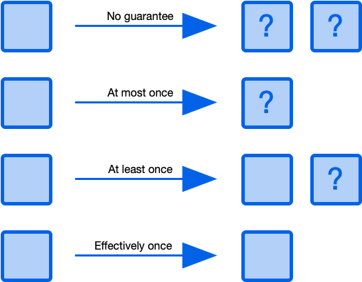

# Others

Created: 2018-10-08 14:19:30 +0500

Modified: 2022-02-02 23:32:55 +0500

---

## Monitoring / Management Tools

1.  Kafka Manager - <https://github.com/yahoo/CMAK>

<https://hub.docker.com/r/kafkamanager/kafka-manager>

2.  Kafka Center - <https://github.com/xaecbd/KafkaCenter>

3.  Kafka lag exporter

<https://github.com/lightbend/kafka-lag-exporter>

<https://www.lightbend.com/blog/monitor-kafka-consumer-group-latency-with-kafka-lag-exporter>

4.  Burrow

5.  Kafdrop

6.  Kafka Tool

7.  Kafka Cruise Control

<https://engineering.linkedin.com/blog/2019/02/introducing-kafka-cruise-control-frontend>

<https://dzone.com/articles/kafka-administration-and-monitoring-ui-tools>

## Message Processing Guarantees
-   **No guarantee-** No explicit guarantee is provided, so consumers may process messages once, multiple times or never at all.
-   **At most once-** This is "best effort" delivery semantics. Consumers will receive and process messages exactly once or not at all.
-   **At least once-** Consumers will receive and process every message, but they may process the same message more than once.
-   **Effectively once-** Also[contentiously](https://streaml.io/blog/exactly-once)[known](https://medium.com/@jaykreps/exactly-once-support-in-apache-kafka-55e1fdd0a35f)as exactly once, this promises consumers will process every message once.

## Storage formats: Serialization and deserialization of events

Events areserializedwhen they are written to a topic anddeserializedwhen they are read. These operations turn binary data into the forms you and I understand, and vice versa. Importantly, these operations are done solely by the Kafkaclients, i.e., producing and consuming applications such as ksqlDB, Kafka Streams, or a microservice using the Go client for Kafka, for example. As such, there is no single "storage format" in Kafka. Common serialization formats used by Kafka clients include Apache Avro™ (with the[Confluent Schema Registry](https://docs.confluent.io/current/schema-registry/index.html)), Protobuf, and JSON.

Kafkabrokers, on the other hand, are agnostic to the serialization format or "type" of a stored event. All they see is a pair of raw bytes for event key and event value (<byte[], byte[]>in Java notation) coming in when being written, and going out when being read. Brokers thus have no idea what's in the data they serve---it's a black box to them. Being this "dumb" is actually pretty smart, because this design decision allows brokers to scale much better than traditional messaging systems.

<https://www.confluent.io/blog/avro-kafka-data

## Data contracts, schema on read, and schema on write

As already mentioned, it is the responsibility of the consuming client (whether it's ksqlDB, Kafka Connect, a custom Kafka consumer, etc.) to deserialize the raw bytes of a Kafka message into the original event by applying some kind of schema, be it a formalized schema in Avro or Protobuf, or an informal JSON format scribbled on the back of a napkin in the company canteen. This means it is, generally speaking, aschema-on-readsetup.

But how does a consuming client know how to deserialize stored events, given that most likely a different client produced them? The answer is that producers and consumers must agree on a data contract in some way. Gwen Shapira covered the important subject of[data contracts and schema management](https://www.confluent.io/blog/schemas-contracts-compatibility)in an earlier blog post, so I'll skip over the details here. But in summary, the easiest option is to use Avro and[Confluent Schema Registry](https://www.confluent.io/confluent-schema-registry/). With a schema registry and a formalized schema (including but not limited to Avro), we are moving from schema on read into[schema-on-write territory](https://www.oreilly.com/ideas/data-governance-and-the-death-of-schema-on-read), which is a boon for pretty much everyone who is working with data, not just the few poor souls of us tasked to "go and do data governance."

And with Confluent Platform 5.4 or newer, you have the additional option to[centrally enforce broker-side Schema Validation](https://www.confluent.io/blog/data-governance-with-schema-validation)so that no misbehaving client can violate the data contract: incoming events are validated server side before they are stored in Kafka topics. This feature is a huge benefit for any Kafka user and especially for larger, regulated organizations.

## Other Stream Processing Brokers
-   Apache Pulsar
-   AWS Kinesis
-   AWS SQS
-   Google Cloud Pub/Sub
-   Azure Event Hubs
-   **redpanda**

Redpanda is the real-time engine for modern apps. Kafka API Compatible; 10x faster

[Co-Designing Raft + Thread-per-Core Execution Model for the Kafka-API](https://youtu.be/kz7R1mGrN9Q)

<https://redpanda.com

<https://github.com/vectorizedio/redpanda>

<https://bravenewgeek.com/benchmarking-message-queue-latency

## Kafka Connect Dead Letter Queues

<https://www.confluent.io/blog/kafka-connect-deep-dive-error-handling-dead-letter-queues

## Kafka Edge Computing

<https://www.kai-waehner.de/blog/2020/01/01/apache-kafka-edge-computing-industrial-iot-retailing-logistics

## Kafka Gotchas

Too many tunable knobs

Unsafe defaults

enable.auto.commit

max.in.flight.requests.per.connection

Appalling tooling

Complicated bootstrapping process

Shaky client libraries

Lack of true multitenancy

Lack of geo-awareness

<https://itnext.io/kafka-gotchas-24b51cc8d44e>

## Compression

<https://cwiki.apache.org/confluence/display/KAFKA/Compression#app-switcher>

When the broker receives a compressed batch of messages from a producer:
-   it always decompresses the data in order to validate it
-   it considers the compression codec of the destination topic
    -   if the compression codec of the destination topic isproducer, or if the codecs of the batch and destination topic are the same, the broker takes the compressed batch from the client and writes it directly to the topic's log file without recompressing the data.
    -   Otherwise, the broker needs to re-compress the data to match the codec of the destination topic.

Decompression and re-compression can also happen if producers are running a version prior to 0.10 because offsets need to be overwritten, or if any other message format conversion is required.

<https://stackoverflow.com/questions/59902385/if-i-set-compression-type-at-topic-level-and-producer-level-which-takes-prece>

<https://stackoverflow.com/questions/48670584/kafka-set-compression-type-at-producer-vs-topic>

## Secor

Secor is a service persisting[Kafka](http://kafka.apache.org/)logs to[Amazon S3](http://aws.amazon.com/s3/),[Google Cloud Storage](https://cloud.google.com/storage/),[Microsoft Azure Blob Storage](https://azure.microsoft.com/en-us/services/storage/blobs/)and[Openstack Swift](http://swift.openstack.org/).

<https://github.com/pinterest/secor>

## Others

<https://kafka-tutorials.confluent.io

<https://www.confluent.io/blog/kafka-streams-tables-part-4-elasticity-fault-tolerance-advanced-concepts>

